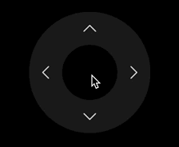

!!! Abstract

    In this section we'll review a few of the AV concepts that are available on Cisco Video Hardware

    Keep in mind, these are high level examples and we have hundreds of API, don't let these be the end of the road in your Journey, it's only the top of the Iceburg. 

    Click each lesson below to expand them, and follow any tasks they introduce

<!-- !!! important "Download AV-MacroPak"

    <figure markdown="span">
        [{ width="200" }](https://raw.githubusercontent.com/WebexCC-SA/LAB-1451/main/docs/assets/downloadable_resources/MacroPak.zip)
      <figcaption>AV-MacroPak</figcaption>
    </figure> -->


??? lesson "Lesson: Video Compositing"

    !!! info

        Most of the of the Cisco Device portfolio can execute at least 1 of the 3 types of video compositing xAPI branches available

    !!! example "Click on the tabs below to learn more about each Video Compositing Branch"

        === "MainVideoSource"

            The SetMainVideoSource xAPI allows us to alter our video output stream, the camera view the far end receives.

            It allows you to compose your camera feed with up to 4 sources in a 2x2 grid, or 2 sources in a PIP or Prominent Style.

            This xAPI is used in solutions such as Presenter and Audience Mode, Classroom Mode and the Campfire Blueprint Macro.

            Just know, the more IO on a codec, the more possibilities. Keep an open mind as you run through examples on smaller devices :smiley:

            <div style="display: flex; gap: 10px;">
                <a class="md-button md-button--primary" href="https://roomos.cisco.com/xapi/Status.Video.Input.MainVideoSource/" target="_blank" >
                  Learn more about xStatus Input MainVideoSource <i class="fa-solid fa-square-up-right"></i>
                </a>
                <a class="md-button md-button--primary" href="https://roomos.cisco.com/xapi/Command.Video.Input.SetMainVideoSource/" target="_blank" >
                  Learn more about xCommand Video Input SetMainVideoSource <i class="fa-solid fa-square-up-right"></i>
                </a>
            </div>

            === "Equal"

                <figure markdown>
                  { width="600" }
                </figure>

            === "PIP"

                <figure markdown>
                  { width="600" }
                </figure>

            === "Prominent"

                <figure markdown="span">
                  { width="600" }
                </figure>

        === "Presentation"

            The Presentation Start command, though not glaringly obvious also allows you to composite sources into a single stream, but over the Content Channel of a call.

            It has largely the same feature set as MainVideoSource with a few notable differences

            <a class="md-button md-button--primary" href="https://roomos.cisco.com/xapi/Command.Presentation.Start/" target="_blank" >
              Learn more about xCommand Presentation Start <i class="fa-solid fa-square-up-right"></i>
            </a>

        === "Video Matrix"

            Video Matrix, again allows you to composite, but it's local to the room.

            You can mix any inputs on the Codec and send them to a specific video output

            Popular uses of the Video Matrix APIs are for local video recording or enabling 2 Laptop shares while on a call, on separate screens (1 local, and another shared in call)

            <a class="md-button md-button--primary" href="https://roomos.cisco.com/xapi/search?search=Video+Matrix+*" target="_blank" >
              Learn more about the Video Matrix APIs <i class="fa-solid fa-square-up-right"></i>
            </a>
        
    - **Task**: 

        - Install the ==Video Compositing Demo== Macro from the AV-MacroPak.zip file
        - Save and Activate this Macro
            - It will spawn a UserInterface for your with all your available sources
        - Goes through each Page in this macro and build new compositions on the fly using the various controls
        
        ??? tip "Inspect the Macro"

            Feel free to inspect the Video Compositing Demo Macro. It's flexible enough to automatically expand how many input and output sources are selectable.

            It queries the Video Input and Output xConfig branches to determine the # of inputs, then dynamically builds the UI.

            But, the User Experience could use some work in a live build don't you think :smiley:
        
        - Once complete, if you have 10 active macros, be sure to deactivate at least 1 before moving on to the next lesson

??? lesson "Lesson: Audio Routing and Control Concepts"

    We won't be able to perform a robust lab on this topic, as Audio Routing is only available on our larger endpoints, and some of our Smaller Endpoints lack the IO to make this section worthwhile

    But, there are a whole suite of APIs associated to Audio Routing, Type and Control

    !!! example ""

        === "Audio Routing"

            Audio Routing is available on Sx80, Codec Pro and Codec EQ based platforms

            !!! important "Know that Codec EQ systems will need a license key for use"

            In the WebUI is a feature called the ==Audio Console==

            The Audio Console, at a high level, allows grouping of audio sources, routing inputs to outputs, adjusting gain structures and the ability to build and assign up to 8 different Equalizers with 6 parametric bands per equalizer 

            You can also alter these route dynamically using the API

            <a class="md-button md-button--primary" href="https://www.cisco.com/c/dam/en/us/td/docs/telepresence/endpoint/ce913/sx-mx-dx-room-kit-boards-customization-guide-ce913.pdf" target="_blank" >
              Learn more about the Audio Console (Page 58) <i class="fa-solid fa-square-up-right"></i>
            </a>

            <a class="md-button md-button--primary" href="https://roomos.cisco.com/xapi/Status.SystemUnit.Software.OptionKeys.AVIntegrator/" target="_blank" >
              Learn more about xStatus SystemUnit Software OptionKeys AVIntegrator <i class="fa-solid fa-square-up-right"></i>
            </a>

            <div style="display: flex; gap: 10px;">
                <a class="md-button md-button--primary" href="https://roomos.cisco.com/xapi/search?search=Audio+Input+LocalInput" target="_blank" >
                  Learn more about Audio Input LocalInput xAPIs <i class="fa-solid fa-square-up-right"></i>
                </a>
                <a class="md-button md-button--primary" href="https://roomos.cisco.com/xapi/search?search=Audio+Output+LocalOutput" target="_blank" >
                  Learn more about Audio Output LocalOutput xAPIs <i class="fa-solid fa-square-up-right"></i>
                </a>
            </div>
        
        === "Audio Types"

            Cisco Video Codecs offer many ways to connect Audio. It's good to know from a design perspective, but it's also good to know that for each Audio Type, there may be a corresponding xAPI to go along with it

            !!! warning ""

                | **Codec Platform**    | **Analog Inputs** | **Analog Inputs** | **USB Inputs** | **USB Outputs** | **Ethernet Inputs (Cisco/AES67)** | **Ethernet Outputs (Cisco`**`/AES67)** |
                |-----------------------|-------------------|-------------------|----------------|-----------------|-----------------------------------|------------------------------------|
                | **_Room Bar_**        |         ❌         |         ❌         |        1       |        1        |                 1                 |                  ❌                 |
                | **_Room Bar Pro_**    |         2         |         1         |        1       |        1        |                3-8*               |                 4*                 |
                | **_Board Pro Gen 2_** |         2         |         1         |        1       |        1        |                3-8*               |                 4*                 |
                | **_Codec EQ_**        |         3         |         1         |        1       |        1        |                3-8*               |                 4*                 |
                | **_Codec Pro_**       |         8         |         6         |        1       |        1        |                 8                 |                  4                 |

                `*` = 8 Ethernet and AES67 Audio requires AES67
                `**` = Cisco's DNAM IV Amplifier is an Ethernet Based Audio Output. Only available on Room Panorama and Codec EQ Systems

            !!! curious ""

                | Codec Platform | **HDMI Audio Inputs** | **HDMI Audio Outputs** | **USB-C Audio Inputs** | **USB-C Audio Outputs** |
                |----------------|-----------------------|------------------------|------------------------|-------------------------|
                | Room Bar       |           1           |            ❌           |        1 (BYOD)        |         1 (BYOD)        |
                | Room Bar Pro   |           1           |            ❌           |        1 (BYOD)        |         1 (BYOD)        |
                | Board Pro G2   |           1           |            ❌           |        1 (BYOD)        |         1 (BYOD)        |
                | Codec EQ       |   3 (1 ARC Enabled)   |            3           |        1 (BYOD)        |         1 (BYOD)        |
                | Codec Pro      |   5 (3 ARC Enabled)   |            3           |            ❌           |            ❌            |

        === "Audio Techniques in the Field"

            === "Individual Microphone Muting"

                It's quite a common request to mute specific audio inputs. It's not possible out of the box for our endpoints, but by altering the Audio Input's ==Configuration Mode== using an automation, you can cut audio input at the source

                All Audio Input types allow you to disable them. That coupled with custom controls on the Touch Panel can enable experiences like this

                <a class="md-button md-button--primary" href="https://roomos.cisco.com/xapi/search?search=Audio+Input+*+*+Mode" target="_blank" >
                  Learn more about Audio Input xConfigurations <i class="fa-solid fa-square-up-right"></i>
                </a>

            === "Audio Ducking"

                You can access Audio VuMeter information from all Audio Input types

                Using this information, and a robust set of rules, you can duck certain microphones in a space when a HandHeld or Lavalier goes hot, giving your presenter the Audio Stage.

                <a class="md-button md-button--primary" href="https://github.com/gve-sw/gve_devnet_webex_codec_ceiling_mic_gain_ducker_macro" target="_blank" >
                  Check out Cisco Devnet's Audio Ducker Macro <i class="fa-solid fa-square-up-right"></i>
                </a>

            === "Audio Based Automation"

                Many asks on the field today are for custom camera automation, and may rely on audio based events

                That's entirely possible, in fact, the Presenter and Audio Solution and Campfire blueprint leverage these techniques

                <a class="md-button md-button--primary" href="https://github.com/ctg-tme/audio-zone-manager-library-macro/tree/main" target="_blank" >
                  Check out the Audio Zone Manager (AZM) Macro Library <i class="fa-solid fa-square-up-right"></i>
                </a>

??? lesson "Lesson: HID Sources"

    !!! info

        In this lesson, we'll leverage the USB HID capabilities of the Codec

        HID Devices, such as keyboards, mice and presentation clickers can connect the the Codec and be used as a Custom Control interface. 

        When ==xConfiguration Peripherals InputDevice Mode== is set to {++On++}, you can leverage ==xEvent UserInterface InputDevice Key Action== to subscribe to those device clicks

        Let's build an Example :smiley:

    -  **xAPI(s)**:
        - xConfiguration Peripherals InputDevice Mode
        - xEvent UserInterface InputDevice Key Action
        - xCommand Video Input SetMainVideoSource
        - xCommand Video Matrix Assign
        - xCommand Audio Volume Increase
        - xCommand Audio Volume Decrease

    - **Goal**:
        - Use the Macro Editor to subscribe to HID Device Inputs coming from a Provided Presentation Clicker
        - Use the events coming in from the device to do the following
            - Left Arrow: Set your Main Source to your Internal Camera
            - Right Arrow: Compose your Camera with an incoming Camera Feed from a Partner Station
            - Up Arrow: Increase your system volume
            - Down Arrow: Decrease your system volume

    - **Setup**:
        - Partner up with another station in this lab
        - Connect the USB Dongle for your Presentation Clicker to any open USB A connector on your Codec
        - Connect Connect the ==Second HDMI Output== from your Codec to the {++HDMI Input++} of your Partner Codec
            - The partner Station should do the same for you

    - **Task**:

        - Create a new Macro called ==Presentation Clicker==
        - Save and Activate this Macro
        - Define and Declare an `init()` function
            - This function should set the following xAPIs and Values using Macro Syntax
                - xConfiguration Peripherals InputDevice Mode: On
                - xCommand Video Matrix Assign ConnectorId: 1 Output: 2
            
            ??? example "View `init()` function"

                ```javascript
                function init(){
                  xapi.Config.Peripherals.InputDevice.Mode.set('On');
                  xapi.Command.Video.Matrix.Assign({
                    ConnectorId: 1,
                    Output: 2
                  });
                }
                ```

        - Subscribe to ==xEvent UserInterface InputDevice Key Action==
            - Within the subscription, establish a `switch...case` statement that switches based on an incoming Key
            
            ??? example "View Presentation Keys"

                | **Button**        | **Keys**                 | **Action to run**                    | **Note**                                                       |
                |-------------------|--------------------------|--------------------------------------|----------------------------------------------------------------|
                | **_Left Arrow_**  | `KEY_PAGEUP`               | Set Camera to Internal Camera        |                                                                |
                | **_Right Arrow_** | `KEY_PAGEDOWN`             | Compose Internal and External Camera |                                                                |
                | **_Up Arrow_**    | `KEY_B`                    | Increase Volume                      |                                                                |
                | **_Down_**        | `KEY_LEFTSHIFT` and `KEY_F5` | Decrease Volume                      | This button alternates keys, handle both with the same command |

            - Assign the following actions to each key, using the provide xAPI written in Macro Syntax
                - **Left Arrow**: xCommand Video Input SetMainVideoSource ConnectorId: 1
                - **Right Arrow**: xCommand Video Input SetMainVideoSource ConnectorId: 1 ConnectorId: 2 Layout: Equal
                - **Up Arrow**: xCommand Audio Volume Increase
                - Down Arrow: xCommand Audio Volume Decrease

            - Add console.log() where appropriate

            ??? example "View InputDevice Subscription"

                ``` javascript
                xapi.Event.UserInterface.InputDevice.Key.Action.on(({ Code, Key, Type }) => {
                  console.log(`Key Pressed: [${Key}]`)
                  switch (Key) {
                    case 'KEY_PAGEUP': //Left Arrow
                      xapi.Command.Video.Input.SetMainVideoSource({ ConnectorId: [1] })
                      break;
                    case 'KEY_PAGEDOWN': // Right Arrow
                      xapi.Command.Video.Input.SetMainVideoSource({ ConnectorId: [1, 2], Layout: 'Equal' })
                      break;
                    case 'KEY_B': // Up Arrow
                      xapi.Command.Audio.Volume.Increase()
                      break;
                    case 'KEY_LEFTSHIFT': case 'KEY_F5': // Down Arrow
                      xapi.Command.Audio.Volume.Decrease()
                      break;
                  }
                })
                ```
            
            - Once complete, save your macro, make sure it's active and try out the Presentation Clicker

    ??? success "Compare your Macro"

        ```javascript
        import xapi from 'xapi';

        function init() {
          xapi.Config.Peripherals.InputDevice.Mode.set('On');
          xapi.Command.Video.Matrix.Assign({
            ConnectorId: 1,
            Output: 2
          });
        }

        init();

        xapi.Event.UserInterface.InputDevice.Key.Action.on(({ Code, Key, Type }) => {
          console.log(`Key Pressed: [${Key}]`)
          switch (Key) {
            case 'KEY_PAGEUP': //Left Arrow
              xapi.Command.Video.Input.SetMainVideoSource({ ConnectorId: [1] })
              break;
            case 'KEY_PAGEDOWN': // Right Arrow
              xapi.Command.Video.Input.SetMainVideoSource({ ConnectorId: [1, 2], Layout: 'Equal' })
              break;
            case 'KEY_B': // Up Arrow
              xapi.Command.Audio.Volume.Increase()
              break;
            case 'KEY_LEFTSHIFT': case 'KEY_F5': // Down Arrow
              xapi.Command.Audio.Volume.Decrease()
              break;
          }
        })
        ```

??? lesson "Lesson: WebView OSD and Controller"

    !!! note 

        All current Cisco Devices have a feature called the ==WebEngine==

        This WebEngine allows you to setup WebApps, WebViews, WebWidgets and Persistent WebApps across varying products

        Simply put, they are Web Pages you can access via your device

    We'll be covering how to open a WebView in the "Building Room Documentation Macr", so for the purposes of this lesson, we want you to check out a pretty impressive macro and web application the Cisco WXSD Sales team has put together that utilizes WebViews simultaneously on the OSD and Touch Controller

    - **Task**:

        - Install the ==webview-websocket== Macro from the AV-MacroPak
        - Save and Activate the macro
        - It will spawn a panel for you called WebSocket Demos
        - Open this interface and try each of the demos

    <a class="md-button md-button--primary" href="https://github.com/wxsd-sales/analytics-web-widget" target="_blank" >
        Learn more about WXSD's webview-websocket Macro<i class="fa-solid fa-square-up-right"></i>
    </a>

??? lesson "Lesson: Room Analytics"

    !!! note

        Let's take a brief break from Macros and install a Web Widget :smiley:

        Web Widgets are a great way to add signage to your Device running in RoomOS mode

        It's Web Content that rests in a non-interactive Modal Window on the OSD of your Codec

        Great for Digital Signage, Company Wide Communication, Stock Tickers, anything that really enhances your User's Experience

    We'll be using WebContent curated by our WXSD Sales Team. They built a Web Widget that leverages the front end jsxapi module that sockets into your Video Endpoint and Pulls the Analytics Information available on the Codec.

    ??? curious "What's the jsxapi module?"

        The jsxapi module is a tool that's hosted external to the codec that can facilitate either an SSH or a WebSocket connection to the endpoint. The syntax is largely similar to Macro syntax, except with a few more steps to establish the socket

        The advantage of the jsxapi is you can embed it into Web Applications as well as leverage other services not accessible on the Codec

        <a class="md-button md-button--primary" href="https://roomos.cisco.com/doc/TechDocs/JSXAPIIntro" target="_blank" >
          Learn more about the jsxapi <i class="fa-solid fa-square-up-right"></i>
        </a>

    - **xAPI(s)**:
        - xConfiguration WebEngine Mode: On
        - xConfiguration WebEngine Features AllowDeviceCertificate: True
        - xConfiguration NetworkServices CommonProxy: Enabled

    - **Task**: 
        - Navigate to the Configuration section of the Codec's WebUI
        - Set the Above xAPI references to the provided values
            - Note, CommonProxy is ONLY available via the WebUI
        
        - Navigate to the UI Extensions Editor

        - Select ==New==
        - Select WebWidget
        - Assign the following URL to the WebWidget

        ```
        https://wxsd-sales.github.io/analytics-web-widget/widget.html?username=ENTER_USERNAME_HERE&password=ENTER_PASSWORD_HERE&ipAddress=ENTER_IP_HERE
        ```

        !!! note

            The URL above has 3 URL parameters you MUST assign

            - username=
            - password=
            - ipAddress=

            Be sure to provide the Username, Password and Ip Address of your codec in these fields. The jsxapi module within the Web App will use this information to form a socket against your endpoint
        
        - Save your UI Extension, you should now see a Web Widget on the OSD of your Device

        <a class="md-button md-button--primary" href="https://github.com/wxsd-sales/analytics-web-widget" target="_blank" >
          Learn more about WXSD's Analytics Web Widget<i class="fa-solid fa-square-up-right"></i>
        </a>

    ??? success "Compare your OSD"

        <figure markdown="span">
          { width="600" }
          <figcaption>Web Widget</figcaption>
        </figure>

??? lesson "Lesson: Triple Click Example"

    !!! info

        At times, we may want to build in tools that should only be available to super users or device admins in a space

        It's common to see hidden interfaces in the wild that allow users to make changes to there space that the everyday user need not interact with, such as modifying a gain structure for Microphones or Re-Routing Displays

        But at face value, our UI Extensions don't offer an obvious solution to that need when you first dive into them

        You may have noticed, while interacting with the Panel Properties, that you can set the Location to "Hidden"

        This allows you to have a UserInterface that's not visible on the touch interface, but can still be opened programmatically via the API

    - Install the ==Triple Click Demo== Macro from the AV-MacroPak.zip file
    - Save and Activate this Macro
        - It will spawn a UserInterface for your with a panel called User Facing Panel
    - Click the Panel and it will open up an interface we want our average user to access
    - Close the panel and then quickly click the panel 3 times to reveal a hidden interface :smiley:
    
    ??? tip "Timing is Key"

        If you inspect the Macro, we're leveraging the SetTimeout and ClearTimeout functions built into ES6 JS to facilitate this action

        Each time the panel is clicked within certain number of milliseconds, we increase a counter and if we reach 3 clicks, we'll open up our hidden interface
    
    !!! challenge "Let's Pin Protect this Hidden Interface!"

        Sometimes, a user may find a hidden interface like this, so in order to further prevent access to it, we can use a TextInput prompt that asks for a pin, before we allow access to this interface

        - **xAPI(s)**: 
            - xCommand UserInterface Message TextInput Display
            - xEvent UserInterface Message TextInput Response
            - xCommand UserInterface Extensions Panel Open

        - **Goal**: 
            - Modify the ==Triple Click Demo== Macro so that the a TextInput prompt opens instead of the hidden interface
            - On a successful pin entry, then open the hidden Interface
            - On a failed pin, re-open the TextInput prompt

        - **Task**: 
            
            - Establish a `pinCode` object in the configuration section with a value of `1234`

            ```javascript
            const pinCode = 1234;
            ```

            - Modify the `openPanel()` function in the ==Triple Click Demo== Macro
            - Your modification should:
                - Replace xCommand UserInterface Extensions Panel Open call with xCommand UserInterface Message TextInput Display and apply the following parameters
                    - Title: "Enter Pin for Access"
                    - Text: "Enter a 4 digit pin below to access a hidden interface"
                    - InputType: PIN
                    - FeedbackId: protectedTripleClick
                    - Duration: 30
                - Note: you'll need that xCommand UserInterface Extensions Panel Open later in code, so best to copy it or comment it out

                ??? example "View Before and After for the `openPanel()` function"

                    === "Before Changes"

                        ```javascript
                        /*This function governs the panel logic*/
                        async function openPanel() {
                          clearTimeout(hiddenAccessHandler); //Clear the handler on each press
                          hiddenAccessCount++; //Increase the count
                          if (hiddenAccessCount == maxClicks) {
                            console.warn({ Message: `Hidden Panel [${multiClickPanel}] revealed` })
                            clearTimeout(hiddenAccessHandler); //Clear the the count threshold is met
                            return xapi.Command.UserInterface.Extensions.Panel.Open({
                              PanelId: multiClickPanel
                            }); //Open the hidden panel
                          }
                          hiddenAccessHandler = setTimeout(function () {
                            console.log({ Message: `Standard Panel [${singleClickPanel}] opened` })
                            xapi.Command.UserInterface.Extensions.Panel.Open({
                              PanelId: singleClickPanel
                            }); //If the button is not pressed quickly enough, open the standard panel
                            hiddenAccessCount = 0; //Reset the count
                          }, delayBetweenClicks_ms)
                        };
                        ```

                    === "After Changes"

                        ```javascript
                        /*This function governs the panel logic*/
                        async function openPanel() {
                          clearTimeout(hiddenAccessHandler);
                          hiddenAccessCount++; 
                          if (hiddenAccessCount == maxClicks) {
                            console.warn({ Message: `Hidden Panel [${multiClickPanel}] Requested` }) // <-- Update our Console Log to Match
                            clearTimeout(hiddenAccessHandler); 

                            return xapi.Command.UserInterface.Message.TextInput.Display({ // <-- Adding our TextInput Prompt
                              Title: 'Enter Pin for Access',
                              Text: 'Enter a 4 digit pin below to access a hidden interface',
                              InputType: 'Pin',
                              FeedbackId: 'protectedTripleClick',
                              Duration: 30
                            })

                            // return xapi.Command.UserInterface.Extensions.Panel.Open({
                            //   PanelId: multiClickPanel
                            // });
                          }
                          hiddenAccessHandler = setTimeout(function () {
                            console.log({ Message: `Standard Panel [${singleClickPanel}] opened` })
                            xapi.Command.UserInterface.Extensions.Panel.Open({
                              PanelId: singleClickPanel
                            }); //If the button is not pressed quickly enough, open the standard panel
                            hiddenAccessCount = 0; //Reset the count
                          }, delayBetweenClicks_ms)
                        };
                        ```
                - We now need a Subscription to the TextInput Response in order to handle the user's pin submission

                - Subscribe to ==xEvent UserInterface Message TextInput Response== using Macro Syntax
                - Within the subscription
                    - Use an `if` statement to check if an incoming TextInput response matches the FeedbackId we set in the TextInput command > =='protectedTripleClick'==
                    - Use the `&&` operator within the same `if` statement to check if the Text matches the `pinCode` object configured in our Macro
                        - If the FeedbackId and Text matches, open the hidden panel using xCommand UserInterface Extensions Panel Open
                        - Else re-open the TextInput Prompt but change the title to "Incorrect Pin Entry, Try Again"

                    ??? example "View Subscription"

                        ``` javascript
                        xapi.Event.UserInterface.Message.TextInput.Response.on(({FeedbackId, Text})=>{
                          if (FeedbackId == 'protectedTripleClick' && Text == pinCode){
                            console.warn({ Message: `Pin Passed, Hidden Panel [${multiClickPanel}] revealed` })
                            xapi.Command.UserInterface.Extensions.Panel.Open({
                              PanelId: multiClickPanel
                            });
                          } else {
                            console.warn({ Message: `Re-prompting Pin Entry forHidden Panel [${multiClickPanel}]` });
                            return xapi.Command.UserInterface.Message.TextInput.Display({
                              Title: 'Incorrect Pin Entry, Try Again',
                              Text: 'Enter a 4 digit pin below to access a hidden interface',
                              InputType: 'Pin',
                              FeedbackId: 'protectedTripleClick',
                              Duration: 30
                            })
                          }
                        })
                        ```

            - Once complete, Save and Activate this Macro
                - It will spawn a UserInterface for your with a panel called User Facing Panel
            - Click the Panel and it will open up an interface we want our average user to access
            - Close the panel and then quickly click the panel 3 times to reveal open the TextInput Prompt
                - Try entering the Correct pinCode (1234)
                - Also try entering the wrong pin
             
        ??? success "Compare your Macro"

            ```javascript
            /********************************************************
            Copyright (c) 2024 Cisco and/or its affiliates.
            This software is licensed to you under the terms of the Cisco Sample
            Code License, Version 1.1 (the "License"). You may obtain a copy of the
            License at
                          https://developer.cisco.com/docs/licenses
            All use of the material herein must be in accordance with the terms of
            the License. All rights not expressly granted by the License are
            reserved. Unless required by applicable law or agreed to separately in
            writing, software distributed under the License is distributed on an "AS
            IS" BASIS, WITHOUT WARRANTIES OR CONDITIONS OF ANY KIND, either express
            or implied.
            *********************************************************/

            /**
             * Macro Author:              Robert(Bobby) McGonigle Jr
             *                            Technical Marketing Engineering, Leader
             *                            Cisco Systems
             * 
             * ---------------------------------------------------------------------
             * Last Revised October 2024
             */

            import xapi from 'xapi';

            /*Configuration Section*/

            const pinCode = 1234;

            const singleClickPanel = 'singleClickPanel' //Panel ID of the Standard Panel you want to open on a single press
            const multiClickPanel = 'multiClickPanel'; //Panel ID of the Hidden Panel you'll reveal in X presses in quick succession
            const userFacingPanel = 'userFacingPanel'; //Panel ID of the user facing panel

            const delayBetweenClicks_ms = 250 //Delay Between Presses in Milliseconds to reveal the Hidden Panel
            const maxClicks = 3 //Number of clicks needed to reveal the panel

            /*Important objects, do not change*/

            let hiddenAccessHandler; //Handles the timeout needed for panel logic
            let hiddenAccessCount = 0; //let needed to track # of clicks presses


            /*This function governs the panel logic*/
            async function openPanel() {
              clearTimeout(hiddenAccessHandler);
              hiddenAccessCount++; 
              if (hiddenAccessCount == maxClicks) {
                console.warn({ Message: `Hidden Panel [${multiClickPanel}] Requested` }) // <-- Update our Console Log to Match
                clearTimeout(hiddenAccessHandler); 

                return xapi.Command.UserInterface.Message.TextInput.Display({ // <-- Adding our TextInput Prompt
                  Title: 'Enter Pin for Access',
                  Text: 'Enter a 4 digit pin below to access a hidden interface',
                  InputType: 'Pin',
                  FeedbackId: 'protectedTripleClick',
                  Duration: 30
                })

                // return xapi.Command.UserInterface.Extensions.Panel.Open({
                //   PanelId: multiClickPanel
                // });
              }
              hiddenAccessHandler = setTimeout(function () {
                console.log({ Message: `Standard Panel [${singleClickPanel}] opened` })
                xapi.Command.UserInterface.Extensions.Panel.Open({
                  PanelId: singleClickPanel
                }); //If the button is not pressed quickly enough, open the standard panel
                hiddenAccessCount = 0; //Reset the count
              }, delayBetweenClicks_ms)
            };

            xapi.Event.UserInterface.Message.TextInput.Response.on(({FeedbackId, Text})=>{
              if (FeedbackId == 'protectedTripleClick' && Text == pinCode){
                console.warn({ Message: `Pin Passed, Hidden Panel [${multiClickPanel}] revealed` })
                xapi.Command.UserInterface.Extensions.Panel.Open({
                  PanelId: multiClickPanel
                });
              } else {
                console.warn({ Message: `Re-prompting Pin Entry forHidden Panel [${multiClickPanel}]` });
                return xapi.Command.UserInterface.Message.TextInput.Display({
                  Title: 'Incorrect Pin Entry, Try Again',
                  Text: 'Enter a 4 digit pin below to access a hidden interface',
                  InputType: 'Pin',
                  FeedbackId: 'protectedTripleClick',
                  Duration: 30
                })
              }
            })


            /*Normal Event logic*/
            xapi.Event.UserInterface.Extensions.Panel.Clicked.on(event => {
              switch (event.PanelId) {
                case userFacingPanel: //Run open panel logic when the User Facing panel is pressed// This can be any action button
                  openPanel()
                  break;
                default:
                  break;
              }
            });

            xapi.Event.UserInterface.Extensions.Widget.Action.on(event => {
              switch (event.WidgetId) {
                case 'visiblePanel_2':
                  xapi.Command.UserInterface.Message.Prompt.Display({
                    Title: 'You did it!',
                    Text: 'You pressed a button<p>Now, find the hidden button to press',
                    Duration: 5,
                    "Option.1": 'Dismiss'
                  })
                  break;
                case 'hiddenPanel_2':
                  xapi.Command.UserInterface.Message.Prompt.Display({
                    Title: 'You did it!',
                    Text: 'You pressed the HIDDEN button<p>Well, that\'s about it, happy coding 😊',
                    Duration: 5,
                    "Option.1": 'Dismiss'
                  })
                  break;
                default:
                  break;
              }
            })

            async function buildPanels() {

              const userFacingXML = `<Extensions>
              <Panel>
                <Origin>local</Origin>
                <Location>HomeScreenAndCallControls</Location>
                <Icon>Concierge</Icon>
                <Color>#CF7900</Color>
                <Name>User Facing Panel</Name>
                <ActivityType>Custom</ActivityType>
              </Panel>
            </Extensions>
            `;

              const singleClickXML = `<Extensions>
              <Panel>
                <Origin>local</Origin>
                <Location>Hidden</Location>
                <Icon>Input</Icon>
                <Name>Visible Panel</Name>
                <ActivityType>Custom</ActivityType>
                <Page>
                  <Name>Normal Visible Panel</Name>
                  <Row>
                    <Name>Row</Name>
                    <Widget>
                      <WidgetId>visiblePanel_1</WidgetId>
                      <Name>Nothing to hide here 😊</Name>
                      <Type>Text</Type>
                      <Options>size=4;fontSize=normal;align=center</Options>
                    </Widget>
                  </Row>
                  <Row>
                    <Name>Row</Name>
                    <Widget>
                      <WidgetId>visiblePanel_2</WidgetId>
                      <Name>Oh Look, A Button 🎉</Name>
                      <Type>Button</Type>
                      <Options>size=4</Options>
                    </Widget>
                  </Row>
                  <Row>
                    <Name>Row</Name>
                    <Widget>
                      <WidgetId>visiblePanel_3</WidgetId>
                      <Name>Exit this panel and tap it 3 times in quick succession to reveal a hidden panel</Name>
                      <Type>Text</Type>
                      <Options>size=4;fontSize=normal;align=center</Options>
                    </Widget>
                  </Row>
                  <Row>
                    <Name>Row</Name>
                    <Widget>
                      <WidgetId>visiblePanel_4</WidgetId>
                      <Name>Feel free to use this example to build tools that don't always need to be visible</Name>
                      <Type>Text</Type>
                      <Options>size=4;fontSize=normal;align=center</Options>
                    </Widget>
                  </Row>
                  <Options>hideRowNames=1</Options>
                </Page>
              </Panel>
            </Extensions>
            `;

              const multiClickXML = `<Extensions>
              <Panel>
                <Origin>local</Origin>
                <Location>Hidden</Location>
                <Icon>Sliders</Icon>
                <Name>Hidden Panel</Name>
                <ActivityType>Custom</ActivityType>
                <Page>
                  <Name>Super Secret Panel</Name>
                  <Row>
                    <Name>Row</Name>
                    <Widget>
                      <WidgetId>hiddenPanel_1</WidgetId>
                      <Name>Tuck away tools for quick changes to your system on the fly</Name>
                      <Type>Text</Type>
                      <Options>size=4;fontSize=normal;align=center</Options>
                    </Widget>
                  </Row>
                  <Row>
                    <Name>Row</Name>
                    <Widget>
                      <WidgetId>hiddenPanel_2</WidgetId>
                      <Name>WHAT?!?! Another Button!!!</Name>
                      <Type>Button</Type>
                      <Options>size=4</Options>
                    </Widget>
                  </Row>
                  <Options>hideRowNames=1</Options>
                </Page>
              </Panel>
            </Extensions>
            `;

              xapi.Command.UserInterface.Extensions.Panel.Save({ PanelId: userFacingPanel }, userFacingXML)

              xapi.Command.UserInterface.Extensions.Panel.Save({ PanelId: singleClickPanel }, singleClickXML)

              xapi.Command.UserInterface.Extensions.Panel.Save({ PanelId: multiClickPanel }, multiClickXML)
            }

            buildPanels();
            ```


??? lesson "Lesson: Pressed and Released Use Cases"

    !!! Note

        Unlike panels, many widgets fire multiple events. These events may seem a bit odd, as they can seam to fire at the same time, but it could be that you're interacting with the Widget a bit too quickly.

        We can leverage these unique events from each widget to craft a more refined User Experience in our customization

        Below is a list of all the Widgets we have today and which events they can fire

        !!! experiment "Click on each table below to review each Widget"

            === "Toggle"

                !!! gif inline end

                    <figure markdown="span">
                        
                        <figcaption>Toggle Action</figcaption>
                    </figure>

                |Key|Value|
                |:--|:----|
                |WidgetId|`Assigned by the Developer on Widget Instantiation`|
                |Type| `changed`|
                |Value| `on` or `off` |

            === "Slider"

                !!! gif inline end

                    <figure markdown="span">
                        
                        <figcaption>Slider Action</figcaption>
                    </figure>

                |Key|Value|
                |:--|:----|
                |WidgetId|`Assigned by the Developer on Widget Instantiation`|
                |Type|`pressed`, `released`, or `changed`|
                |Value| `Integer between 0 and 255` |

            === "Button"

                !!! gif inline end

                    <figure markdown="span">
                        
                        <figcaption>Button Action</figcaption>
                    </figure>

                |Key|Value|
                |:--|:----|
                |WidgetId|`Assigned by the Developer on Widget Instantiation`|
                |Type|`pressed`, `released`, or `clicked`|
                |Value| N/A |

            === "GroupButton"

                !!! gif inline end

                    <figure markdown="span">
                        
                        <figcaption>Group Button Action</figcaption>
                    </figure>

                |Key|Value|
                |:--|:----|
                |WidgetId|`Assigned by the Developer on Widget Instantiation`|
                |Type|`pressed`, `released`|
                |Value| `Assigned by the Developer on Widget Instantiation` |

            === "Icon Button"

                !!! gif inline end

                    <figure markdown="span">
                        
                        <figcaption>Icon Button Icons</figcaption>
                    </figure>

                |Key|Value|
                |:--|:----|
                |WidgetId|`Assigned by the Developer on Widget Instantiation`|
                |Type|`pressed`, `released`, or `clicked`|
                |Value| N/A |

            === "Spinner"

                !!! gif inline end

                    <figure markdown="span">
                        
                        <figcaption>Spinner Icons</figcaption>
                    </figure>

                |Key|Value|
                |:--|:----|
                |WidgetId|`Assigned by the Developer on Widget Instantiation`|
                |Type|`pressed`, `released`, or `clicked`|
                |Value| `increment` or `decrement` |

            === "TextBox"

                !!! failure "Does not fire events"

            === "Directional Pad"

                !!! gif inline end

                    <figure markdown="span">
                        
                        <figcaption>Directional Pad Action</figcaption>
                    </figure>

                |Key|Value|
                |:--|:----|
                |WidgetId|`Assigned by the Developer on Widget Instantiation`|
                |Type|`pressed`, `released`, or `clicked`|
                |Value| `up`, `down`, `left`, `right`, `center` |

            === "Spacer"

                !!! failure "Does not fire events"

    - **xAPI(s)**: 
        - xEvent UserInterface Extensions Widget Action
        - xCommand UserInterface Message Rating Display
        - xCommand UserInterface Extensions Panel Open
        - xCommand Audio Sound Play

    - **Goal**: 
        - Like we did with Panels, we can open a hidden interface based on certain events coming from a widget

        - Leverage the Pressed and Released types of a Widget Button's events in 2 different ways
        - Pressed: When held for 3 seconds, open up a hidden panel
        - Released: If released before the 3 second mark, open up a Message Rating prompt

    - **Task**: 

        - Install the ==MessageRating.xml== UI extension in the UI Extensions Editor
        - Install the ==HiddenMenu.xml== UI extension in the UI Extensions Editor

        - Create a new Macro called ==Pressed and Released Demo==, save and activate it

        - In this macro do the following
            - define an object called `pressHandler` and assign the value of `''`;
            - define an object called `showHidden` and assign the value of `false`;
                - 

            ``` javascript
            let pressHandler = '';
            let showHidden = false;
            ```

            - Subscribe to xEvent UserInterface Extensions Widget Action
            - Within this Subscription:
                - Use an `if` statement to see if the WidgetId matches "ratingSystem"
                - Use an `if` statement to compare the incoming Widget Type to the value `pressed`
                    - Within this `if` statement, assign ES6 JS's ==setTimeout()== function to the `pressHandler` object
                    - In the first parameter of the ==setTimeout()==, assign a short-hand function  and define the following in this short-hand function
                        - xCommand Audio Sound Play Sound: Binding
                        - Update `showHidden = true;`

                    - In the first parameter of the ==setTimeout()==, assign the value of `3000` (milliseconds)
                - Use an `if` statement to compare the incoming Widget Type to the value `released`
                    - Within this `if` statement, run the ES6 JS function ==clearTimeout()== and pass `pressHandler` object as it's only parameter

                    - Use an `if` statement to check the value of the `showHidden` object
                        - If true, do the following
                            - Run xCommand UserInterface Extensions Panel Open with the following parameter
                                - PanelId: hiddenMenu
                            - Update `showHidden = false;`
                        - If false, do the following
                            - Run xCommand UserInterface Message Rating Display with the following Parameters
                                - Title: "Rate this Experience"
                                - Text: "1 being the lowest, 5 being the highest"
                                - Duration: 30

            ??? example "View Subscription"

                ``` javascript
                xapi.Event.UserInterface.Extensions.Widget.Action.on(({ WidgetId, Type, Value }) => {
                  if (WidgetId == 'ratingSystem') {
                    if (Type == 'pressed') {
                      pressHandler = setTimeout(() => {
                        showHidden = true;
                        xapi.Command.Audio.Sound.Play({ Sound: 'Binding' });
                        return;
                      }, 3000);
                    };

                    if (Type == 'released') {
                      clearInterval(pressHandler);
                      if (showHidden) {
                        showHidden = false;
                        xapi.Command.UserInterface.Extensions.Panel.Open({ PanelId: 'hiddenMenu' });
                      } else {
                        xapi.Command.UserInterface.Message.Rating.Display({
                          Title: 'Rate this Experience',
                          Text: '1 being the lowest, 5 being the highest',
                          Duration: 30
                        });
                      }
                    }
                  }
                })
                ```

            - Once complete, Save and Activate this Macro
            - Open the ==Pressed and Released== Demo Panel
                - Click the {++Start Survey++} Button
                    - You should see the Rating Display with a selection of 1 to 5 start
                - Then tress and hold the Start Survey {++Start Survey++} for 3 seconds
                    - You should hear a faint **beep beep**
                    - That sound indicates you held the button long enough and can now release
                        - You should see a Secret Rating System contained in a Panel using a Group Button

        ??? "Compare your Macro"

            ```javascript
            import xapi from 'xapi';

            let pressHandler = '';

            let showHidden = false;

            xapi.Event.UserInterface.Extensions.Widget.Action.on(({ WidgetId, Type, Value }) => {
              if (WidgetId == 'ratingSystem') {
                if (Type == 'pressed') {
                  pressHandler = setTimeout(() => {
                    showHidden = true;
                    xapi.Command.Audio.Sound.Play({ Sound: 'Binding' });
                    return;
                  }, 3000);
                };

                if (Type == 'released') {
                  clearInterval(pressHandler);
                  if (showHidden) {
                    showHidden = false;
                    xapi.Command.UserInterface.Extensions.Panel.Open({ PanelId: 'hiddenMenu' });
                  } else {
                    xapi.Command.UserInterface.Message.Rating.Display({
                      Title: 'Rate this Experience',
                      Text: '1 being the lowest, 5 being the highest',
                      Duration: 30
                    });
                  }
                }
              }
            })
            ```

<!-- ??? lesson "Lesson: Bad Macro, how to fix" -->