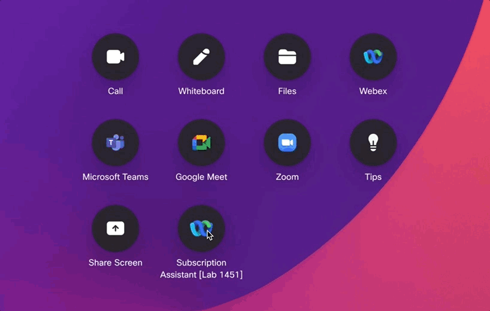

<div>
  <script>
    document.addEventListener('DOMContentLoaded', () => {
      const footerNav = document.querySelector('.md-footer__inner');
      if (footerNav) {
        footerNav.style.display = 'none';
      }
    });
  </script>
</div>

???+ blank "Part 2: Accessing the Video Device xAPI"

    ??? info "Subscription Assistant Macro"

        === "How to Use"

            This macro was built to assist you for lessons where you'll Subscribe/Register Feedback to various xAPI Paths. Do not modify this macro, but feel free to learn from this macro and how it operates. 

            We won't be reviewing this macro in this lab, so if we'd encourage you take a copy home with you, and review outside this course

            === "Home Screen"

                { width="600" , align=right }

                After installing and enabling the Subscription Assistant Macro, the macro will generate a UI extension on your Codec's Touch Control Surface

                Clicking on this button, will open various tools for you to use when running through Part 2

                ??? gif "View UI Operation"

                    <figure markdown>
                      { width="600" }
                    </figure>

            === "xConfigurations"

                { width="600" , align=right }

                In the xConfigurations Page, you'll have tools for modifying xConfigurations on your device. 
                
                Use these tools when Subscribing/Registering feedback to xConfigurations throughout the various lessons in Part 2

            === "xStatuses"

                { width="600" , align=right }

                In the xStatuses Page, you'll have tools that will issue certain xCommands that will cause certain xStatus events to fire on your device. 
                
                Use these tools when Subscribing/Registering feedback to xStatus throughout the various lessons in Part 2

            === "xEvents"

                { width="600" , align=right }

                In the xEvents Page, you'll have tools that will cause certain xEvent events to fire on your device. 
                
                Use these tools when Subscribing/Registering feedback to xEvents throughout the various lessons in Part 2

            === "Section Cleanup"

                { width="600" , align=right }

                Throughout Part 2, we will Subscribe to the same xAPI paths from each Integration Method. This is to familiarize you more with the Syntax of each integration method and how to structure that xApi Path.

                That Said, we need to clean up the Codec at the end of each Section. When prompted to by the Lab Guide, run the Section Cleanup button. This will prepare the device for the next set of lessons in Part 2

        === "Download and Install"

            === "Download"

                <figure markdown="span">
                    [{ width="300" }](https://github.com/WebexCC-SA/LAB-1451/raw/refs/heads/main/docs/assets/downloadable_resources/Lab-1451_Subscription-Assistant_Part-2.zip)
                    <figcaption>Lab-1451_Subscription-Assistant_Part-2 Macro</figcaption>
                </figure>
                
            === "Install"

                !!! gif

                    - Locate the `Lab-1451_Subscription-Assistant_Part-2.zip` file you downloaded
                    - Unzip it's Contents
                    - Drag the `Lab-1451_Subscription-Assistant_Part-2.js` file into the WebUI of your Device
                    - Save the Macro
                    - Activate the Macro

                    <figure markdown>
                      { width="600" }
                    </figure>

    ??? info "Terminal Shortcut References"

        | Key              | Description      |
        | :-------         | :-------         |
        | `?`              | List all commands under a given node Path         |
        | `??`             | List all commands `and value spaces` under a given node Path         |
        | `//`             | Path wild, use to search for key words in any given path. You can use multiple wildcards in a xAPI path         |
        | ++tab++| Auto-completes the command string         |

    ??? info "xAPI Branch Capabilities"

        | **xAPI Branch**    | **Get Value** | **Set Value** | **Run Action** | **Subscribe to Value** |
        |--------------------|---------------|---------------|----------------|------------------------|
        | **xCommands**      |       [🔶^1^](# "Though commands don't have values assigned, some do generate data and provide a response similar to Getting a Status or Config")       |       ❌       |        ✅       |            ❌           |
        | **xConfiguration** |       ✅       |       ✅       |        ❌       |            ✅           |
        | **xStatus**        |       ✅       |       ✅       |        ❌       |            ✅           |
        | **xEvent**         |       ❌       |       ❌       |        ❌       |            ✅           |

    ??? info "Websocket Message Structure Examples and Responses"

        === "xCommand/[Path]"

            xCommand Paths follow the ==xCommand== method in the `method` object, separated by forward slash ( ==/== )

            Parameters for the xCommand are defined as individual objects under the `params` object written in JSON format

            === "Request <i class="fa-solid fa-share"></i>"

                ```JSON
                {
                  "jsonrpc": "2.0",
                  "id": 111,
                  "method": "xCommand/Dial",
                  "params": {
                    "Number": "bobby@example.com",
                    "Protocol": "Spark"
                  }
                }
                ```
            
            === "Response <i class="fa-solid fa-reply"></i>"

                ```JSON
                {
                  "jsonrpc": "2.0",
                  "id": 111,
                  "result": {
                  "CallId": 2,
                  "ConferenceId": 1
                  }
                }
                ```

            === "Error Response <i class="fa-solid fa-triangle-exclamation"></i>"

                ```JSON
                {
                  "jsonrpc": "2.0",
                  "id": 111,
                  "error": {
                    "code": 1,
                      "data": {
                      "Cause": 21
                    },
                    "message": "Not paired with isdn link"
                  }
                }
                ```

        === "xGet [xStatus/xConfiguration]"

            `xStatus` and `xConfiguration` branches can make use of the ==xGet== method. Unlike Commands, the xAPI path is provided in the params object under a Path object and is structured as an Array

            === "Request <i class="fa-solid fa-share"></i>"

                ```JSON
                {
                  "jsonrpc": "2.0",
                  "id": 102,
                  "method": "xGet",
                  "params": {
                    "Path": ["Configuration", "SystemUnit", "Name"]
                  }
                }   
                ```
            
            === "Response <i class="fa-solid fa-reply"></i>"

                ```JSON
                {
                  "jsonrpc": "2.0",
                  "id": 102,
                  "result": "my-device"
                }
                ```

        === "xQuery [xStatus/xConfiguration]"

            `xStatus` and `xConfiguration` branches can make use of the ==xQuery== method. xQuery is formatted and functions largely like the xGet method

            !!! note "Note the difference between `xQuery` and `xGet`"

                - The response to xQuery always starts from the top node, i.e. "Status" or "Configuration".
                - The response to xGet starts relative to the path given in the "Query".
                - xQuery can also implement Wildcards (`**`) in it's path, which matches zero or more levels in the path.

            === "Request <i class="fa-solid fa-share"></i>"

                ```JSON
                {
                  "jsonrpc": "2.0",
                  "id": 105,
                  "method": "xQuery",
                  "params": {
                    "Query": ["Status", "**", "DisplayName"] 
                  }
                }
                ```
            
            === "Response <i class="fa-solid fa-reply"></i>"

                ```JSON
                {
                  "jsonrpc": "2.0",
                  "id": 105,
                  "result": {
                    "Status": {
                      "SIP": {
                        "CallForward": {
                          "DisplayName": "Room Bar Pro"
                        }
                      },
                      "SystemUnit": {
                        "Software": {
                          "DisplayName": "RoomOS 11.20..."
                        }
                      }
                    }
                  }
                }
                ```

        === "xSet [xConfiguration]"

            === "Request <i class="fa-solid fa-share"></i>"

                ```JSON
                {
                  "jsonrpc": "2.0",
                  "id": 110,
                  "method": "xSet",
                  "params": {
                    "Path": ["Configuration","SystemUnit","Name"],
                    "Value": "My New System Name"
                  }
                }
                ```
            
            === "Response <i class="fa-solid fa-reply"></i>"

                ```JSON
                {
                  "jsonrpc": "2.0",
                  "id": 110,
                  "result": true
                }
                ```

        === "xFeedback [xStatus/xConfiguration/xEvent]"

            xFeedback, or Subscriptions, have 2 Id objects within the life of it's process. When sending any message, you will assign an `id` and get an initial response containing that same `id`. But when you subscribe, it will contain an additional ==Id== in it's results object which corresponds to this specific subscription. All notifications after the initial response from this subscription will contain the Subscription ==Id== not the initial message `id`. This is important, as you may have multiple or similar subscriptions you may want to instantiate and handle separately as you develop your solution.

            === "Subscribe Request <i class="fa-solid fa-share"></i>"

                ```JSON
                {
                  "jsonrpc": "2.0",
                  "id": 113, // <-- This is the Message id
                  "method": "xFeedback/Subscribe",
                  "params": {
                    "Query": ["Status", "Video", "Selfview"],
                    "NotifyCurrentValue": true // <-- When true, will respond with additional notifications
                  }
                }
                ```
            
            === "Initial Response <i class="fa-solid fa-reply"></i>"

                ```JSON
                {
                  "jsonrpc": "2.0",
                  "id": 113,
                  "result": {
                    "Id": 1 // <-- This is the Subscription Id of the new feedback registration. Use this Subscription Id to map incoming notifications to the initial subscription request, or to unsubscribe from this data
                  }
                }
                ```

            === "Notification Response <i class="fa-solid fa-reply"></i>"

                ```JSON
                {
                  "jsonrpc": "2.0",
                  "method": "xFeedback/Event",
                  "params": {
                    "Id": 1, // <-- This is the Subscription Id of the feedback registration.
                    "Status": {
                      "Video": {
                        "Selfview": {
                          "FullscreenMode": "Off",
                          "Mode": "Off",
                          "OnMonitorRole": "First",
                          "PIPPosition": "CenterRight"
                        }
                      }
                    }
                  }
                }
                ```

            === "Unsubscribe Request <i class="fa-solid fa-share"></i>"

                ```JSON
                {
                  "jsonrpc": "2.0",
                  "id": 113, // <-- This is the Message id
                  "method": "xFeedback/Subscribe",
                  "params": {
                    "Id": 1, // <-- This is the Subscription Id of the initial feedback registration.
                  }
                }
                ```
            
            ??? curious "Subscription Visual Flow"

                ``` mermaid
                sequenceDiagram
                    participant My Customization
                    participant Target Codec
                    My Customization<<-->>Target Codec: Websocket Connection
                    Note over My Customization,Target Codec: Register Subscription
                    My Customization->>+Target Codec: xFeedback/Subscribe [Message `id`#58; 101]
                    Target Codec ->> My Customization: Acknowledges Message `id`#58; 101<br>[Provides Subscription `Id`#58; 1]
                    Note over My Customization,Target Codec: Incoming Events
                    Target Codec -->>+ My Customization: <br> Event Payload. Contains [Subscription `Id`#58; 1]
                    Target Codec -->> My Customization: <br> Event Payload. [Subscription `Id`#58; 1]
                    Target Codec -->>- My Customization: <br> ........... [Subscription `Id`#58; 1]
                    Note over My Customization,Target Codec: Deregister Subscription
                    My Customization->>-Target Codec: xFeedback/Unsubscribe <br>Provide Subscription [`Id`#58; 1] NOT Message [`id`#58; 101] as param<br>[Subscription `Id`#58; 1]
                ```

??? blank "Part 3:  Building a Device Customization using Macros"

    ??? info "..."

        ...