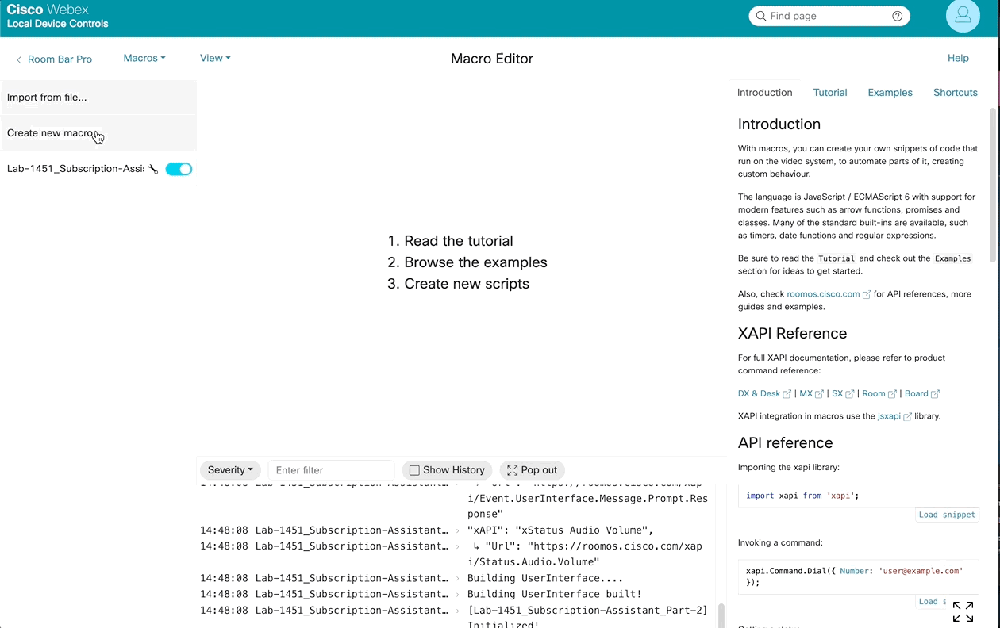

# <u>**Part 3: Building a Device Customization using Macros**</u>

## <u>**Section 3.1: Outlining our Customization**</u>

!!! abstract

    When Jumping into your customization, it's good to understand a few things prior to diving in. 

    You should should consider the following

    <h4>KEEP THINGS SIMPLE :smiley:</h4>

    - There are some pretty robust solutions out there. It can be easy to over-engineer a solution, especially as your skill set starts to flourish.
    - Wherever possible, keep things simple
        - But sometimes too simple can be a bottleneck, do what's best to provide a robust solution, while also not getting too far into the weeds.

    <h4>Understanding your Hardware</h4>

    - What are the hardware and software differences between codecs?
        - Should I hard code Video Output 3 or should I dynamically discover those inputs
    - How many peripherals are connected?
        - This could change from room to room. Knowing how to adapt this in your solution dynamically will reduce complications when deploying at scale
    - Are there differences in how the xAPI is executed between devices?
        - There certainly is, but it's not impossible to handle and make you solution robust and rugged
    - What external services are available to me to optimize or enhance this experience?
        - APIs are wonderful, and everywhere. Explore them and find out what's possible when they start to work together

    <h4>Understanding your Stakeholders</h4>

    - Who will interact with my customization?
        - IT Folks, C-Suite, Engineers, Admins, Etc
    - Are you working with the person procuring or using the solution?
        - Procurement and the end use may be one in the same, but at times they are disconnected. If possible, engage with those who ultimately use your customization to get a better understanding of their need.
    - How do these individuals do work?
        - Is this a seminar space, a conference room, an open collaboration space, a classroom, a lab?
        - Optimizing your solution to fit those needs are key to success
    - What are their expectations of the solution?
        - Is the vision of the end user in line with your vision of the solution. Keeping an open dialogue with your customer as to what's possible will help keep your goals in line
    - What can you anticipate that wasn't considered in the original ask?
        - Some asks are too simple. Putting in the extra 2 cents to really flesh out a professional solution, even for a small ask, can yield a better solution in the end.

    <h4>Tackle your solution from outside the box</h4>

    - Best to design for scale, wherever possible
        - How can I make my solution on all hardware and software iterations?
    - Make you solution flexible
        - If your code can solve for multiple room flows, build in tools to let you quickly adapt your code
    - Think of your colleagues and future self
        - Some day you or a colleague may be called upon to troubleshoot a solution, make sure you leave breadcrumbs or documentation to help yourself years from now.

!!! important "Today's solution outline"

    In part 3 of this lab, we'll build a Macro that will allow folks to either View a Document or Scan a QR code to take the document with them on your device

    We'll review how to:

    - Build a UserInterface
    - Map those UserInterface elements to actions driven by an accompanying macro
    - Integrate a 3rd party QR code service, leveraging APIs external to the Codec
    - Organize our code and make it scalable
    - Automate the generation of out UserInterface

- - -
- - -

## <u>**Section 3.2: Building the UserInterface (UI)**</u>

### **3.2.1 - Navigating the UI Extensions Editor**

!!! example "Access the UI Extensions Editor"

    === "Device Login"

        - Open a Browser and enter your Codec's IP as a URL and hit enter
        - Login with your Username and Password

        <figure markdown="span">
            { width="600" }
            <figcaption>Device Login Page</figcaption>
        </figure>

    === "Device Home"

        - Select the UI Extensions Editor on the Left-Hand Navigation Bar

        <figure markdown="span">
            { width="700" }
            <figcaption>Device Home Page</figcaption>
        </figure>

    === "UI Extensions Editor"

        <figure markdown="span">
            { width="800" }
            <figcaption>UI Extensions Editor</figcaption>
        </figure>

    === "Adding a Panel"

        !!! important inline end "Always Assign Unique PanelIds"

            You may not be the only developer. Assigning PanelIds unique to your solution helps limit conflicts with other solutions.

        !!! Gif "How to Add a Panel"

            <figure markdown="span">
                { width="600" }
                <figcaption>Adding a new Panel</figcaption>
            </figure>

        !!! info

            - Panels
                - Creates a Panel with pages and rows within, containing widgets
            - Action Buttons
                - Creates a panel
            - Web Widgets
                - Creates a Web Widget on your OSD
            - Web Apps
                - Creates a Panel, that when `clicked`, opens a URL to a target Web Page

    === "Adding Widgets"

        !!! important inline end "Always Assign Unique WidgetIds"
        
            You may not be the only developer. Assigning WidgetIds unique to your solution helps limit conflicts with other solutions.

        !!! Gif "How to Add Widgets"

              <figure markdown="span">
                { width="600" }
                <figcaption>Adding bew Widgets</figcaption>
            </figure>

    === "Edit Text Elements"

        !!! tip inline end

            Some text elements have limited space, but you won't see an error

            Make sure the Text Renders correctly on your device after you apply it

        !!! Gif

              <figure markdown="span">
                { width="600" }
                <figcaption>Editing Text Elements</figcaption>
            </figure>

        !!! info

            - Double clicking on any text element allows you to edit the filed
            - Change the Text as you need it, then press enter

    === "Add/Delete Rows and Pages"

        !!! tip  inline end
            
            Keep in mind more is not always better. Try to keep things simple


        !!! Gif

              <figure markdown="span">
                { width="600" }
                <figcaption>Adding a new Panel</figcaption>
            </figure>

        !!! info

            - You can add as many rows and pages as your solution needs

### **3.2.2 - Creating our Customization's Interface**

???+ lesson "Lesson: Create a New Panel Button"

    !!! tool inline end "Save Extension Button"

        <figure markdown="span">
            
            <!-- <figcaption>Adding a new Panel</figcaption> -->
        </figure>

    - **Task**: 

        - Create a new Panel
        - Assign this panel's ==id== as: <pre><code>wx1_QrDocs</code></pre>
        - Assign this panel's ==name== as: <pre><code>Room Docs</code></pre>
        - Assign this panel's ==location== as: `HomeScreenAndCallControls`
        - Pick any icon you wish
        - Pick any Panel Color you wish
        - Save your Extension
            - You should be able to see your Panel on the Codec's Touch Interface

    ??? success "View Successful UI Execution"

        === "OSD"

            <figure markdown="span">
                { width="600" }
                <!-- <figcaption>Adding a new Panel</figcaption> -->
            </figure>

        === "Opened Panel"

            <figure markdown="span">
                { width="600" }
                <!-- <figcaption>Adding a new Panel</figcaption> -->
            </figure>

        === "UI Properties"

            <figure markdown="span">
                { width="150" }
                <!-- <figcaption>Adding a new Panel</figcaption> -->
            </figure>
        
    ??? challenge "Challenge: Rename the Page to Room Docs"

        - Rename the Page Name from `Page` to: <pre><code>Room Docs</code></pre>
        - Assign the PageId as: <pre><code>wx1_QrDocs\~RoomDocs</code></pre>

??? lesson "Lesson: Add Solution Widgets"

    !!! tool inline end "Save Extension Button"

        <figure markdown="span">
            
            <!-- <figcaption>Adding a new Panel</figcaption> -->
        </figure>

    - **Task**: 

        - Rename Row 1 to: <pre><code>Lab 1451</code></pre>
            - Add 2 Buttons to this row
                - Set the following properties for the left button
                    - Rename Button Text `Button` to: <pre><code>Open Site</code></pre>
                    - Assign WidgetId: <pre><code>wx1_QrDocs\~OpenSite\~https://webexcc-sa.github.io/LAB-1451/wx1_1451_part_3/</code></pre>
                    - Set the Widget Width to 2
                - Set the following properties for the Right button
                    - Rename Button Text `Button` to: <pre><code>Open QrCode 🔳</code></pre>
                    - Assign WidgetId: <pre><code>wx1_QrDocs\~OpenQrCode\~https://webexcc-sa.github.io/LAB-1451/wx1_1451_part_3/</code></pre>
                    - Set the Widget Width to 2
        - Add a second row, with the name: <pre><code>Reimagine Workspaces</code></pre>
            - Add 2 Buttons to this row
                - Set the following properties for the left button
                    - Rename Button Text `Button` to: <pre><code>Open Site</code></pre>
                    - Assign WidgetId: <pre><code>wx1_QrDocs\~OpenSite\~https://www.webex.com/us/en/workspaces.html</code></pre>
                    - Set the Widget Width to 2
                - Set the following properties for the Right button
                    - Rename Button Text `Button` to: <pre><code>Open QrCode 🔳</code></pre>
                    - Assign WidgetId: <pre><code>wx1_QrDocs\~OpenQrCode\~https://www.webex.com/us/en/workspaces.html</code></pre>
                    - Set the Widget Width to 2
        - Save your Extension
            - You should be able to see your Panel on the Codec's Touch Interface

    ??? success "View Successful UI Execution"

        <figure markdown="span">
            { width="600" }
            <!-- <figcaption>Adding a new Panel</figcaption> -->
        </figure>

    ??? challenge "Add your Organization's HomePage :smiley:"

        You may have noticed the WidgetIds have a URL as apart of the ID

        We'll be using this in the Macro we write later, to open this page

        Here is how we're structuring WidgetIds for this lab

        !!! example

            - WidgetId Structure: appName\~Action\~URL

                - appName: `wx1_QrDocs` -> Let's us associate this interface with our Macro Script and helps make the WidgetId more unique
                - action: `OpenSite` or `OpenQrCode` -> This will tell use how we want to open our URL
                - URL: This is the URL we want to open, or build a QR Code for
                - String Separator: `~` -> Using a unique character, such as this tilde, can help use split up and access this information later in the Macro

            ??? curious "Is this WidgetId format mandatory?"

                Widget Ids are strings. This is just one of many examples of how you can structure your widgets. It's not required to structure them like this, {++with the exception of this lab++}. 
                
                So long as they are unique in your customization, you should be good to go

        - Task: 
            - Create a 3rd Row
            - Add in an ==Open== Site button and an ==Open QrCode 🔳== with your Organizations Home Page as the Url
            - Be sure to assign `wx1_QrDocs` as the appName and the correct action to the button they represent

        ??? tip "Hint"

            OpenSite: <pre><code>wx1_QrDocs\~OpenSite\~==YOUR_ORG_HOMEPAGE==</code></pre>
            OpenQrCode: <pre><code>wx1_QrDocs\~OpenQrCode\~==YOUR_ORG_HOMEPAGE==</code></pre>

- - -
- - -

## <u>**Section 3.3: Adding Function to the UI with Macros**</u>

!!! Abstract

    Now that we have our UserInterface in place, we can start to build our solution

    We'll be using the Macro Editor for this solution, but know that you can do these very same tasks from any other avenue we explored in Part 2 of this lab

    The benefit of Macros, is that they come with every Cisco Codec running Ce9.2 or newer (with the exception of the Sx10). So no need to procure hardware or spin up a service to start building a solution :smiley:

    !!! important "Note"

        It's recommended you have run through sections 2.2 and 2.6 as a Minimum before proceeding

### **3.3.1 - Navigating the Macro Editor and Creating our new Macro**

If you missed Section 2.6 in part 2 of this lab, please watch this Vidcast

??? vidcast "Vidcast: Macro Editor IDE Review"

    <div style="padding-bottom:56.25%; position:relative; display:block; width: 100%">
      <iframe src="https://app.vidcast.io/share/embed/d6dacbb3-9792-4d27-b1fa-434f2ff37f03" width="100%" height="100%" title="Macro Editor IDE Review" frameborder="0" loading="lazy" allowfullscreen style="position:absolute; top:0; left: 0;border: solid; border-radius:12px;"></iframe>
    </div>

!!! Important "Create a new Macro"

    - Select ==Create new macro== in the Macro Editor
    - Name this macro ==Room Docs==
    - {++Save++} and {++Activate+++} the ==Room Docs== Macro

    ??? success "Compare your Setup"

        === "Device Login"

            !!! failure ""

                if NOT already logged into the endpoint, follow these steps
            
                - Open a Browser and enter your Codec's IP as a URL and hit enter
                - Login with your Username and Password

                <figure markdown="span">
                    { width="400" }
                    <figcaption>Device Login Page</figcaption>
                </figure>

            !!! warning ""

                If in the UI Extensions Editor

                - Click on the Device Name in the Top Left hand corner of the UI Extensions Editor to get back to the Device Home Page

        === "Device Home"

            <figure markdown="span">
                { width="600" }
                <figcaption>Device Home Page</figcaption>
            </figure>

        === "Macro Editor"

            <figure markdown="span">
                { width="700" }
                <figcaption>The Macro Editor</figcaption>
            </figure>

        === "Create, Save and Activate a Macro"

            !!! gif "Create, Save and Activate a Macro"

                <figure markdown="span">
                    { width="600" }
                    <figcaption>Create, Save and Activate a Macro</figcaption>
                </figure>

### <u>**Section 3.3.2: Accessing UI Events and Logging**</u>


???+ lesson "Lesson: Subscribing to Widget Actions"

    - **xAPI**: xEvent UserInterface Widget Action

    - **Task**:

        - Let's start by subscribing to the xAPI Path above using Macro Syntax

        - Take the Callback information generated by this event, and log it to the Macro Console using `console.log()`

        - Once complete, ==Save== and Activate the macro (if inactive)

        - Start pressing the ==Open Site== and ==Open QrCode 🔳== buttons contained within your `Room Docs` panel
        - Monitor the Macro Console Output

    ??? success "Compare your Macro"

        !!! Note

            It's ok if your macro's structure doesn't match 1:1 with the examples below

            As long as they information we access is the same, then format is up to the developers preference

        ```javascript
        import xapi from 'xapi';

        xapi.Event.UserInterface.Extensions.Widget.Action.on(({WidgetId, Type, Value}) => {
          console.log({WidgetId, Type, Value})
        })
        ```

    ??? success "Compare your Macro Console"

        | Time     | Macro      | WidgetId                                                                                         | Type     | Value |
        |----------|-----------|--------------------------------------------------------------------------------------------------|----------|-------|
        | HH:MM:SS | Room Docs | wx1_QrDocs\~OpenQrCode\~https://webexcc-sa.github.io/LAB-1451/wx1_1451_part_3/                  | {++pressed++}  |`    `|
        | HH:MM:SS | Room Docs | wx1_QrDocs\~OpenQrCode\~https://webexcc-sa.github.io/LAB-1451/wx1_1451_part_3/                  | ==released== |`    `|
        | HH:MM:SS | Room Docs | wx1_QrDocs\~OpenQrCode\~https://webexcc-sa.github.io/LAB-1451/wx1_1451_part_3/                  | `clicked`  |`    `|
        | HH:MM:SS | Room Docs | wx1_QrDocs\~OpenQrCode\~https://webexcc-sa.github.io/LAB-1451/wx1_1451_part_3/                   | {++pressed++}  |`    `|
        | HH:MM:SS | Room Docs | wx1_QrDocs\~OpenQrCode\~https://webexcc-sa.github.io/LAB-1451/wx1_1451_part_3/                   | ==released== |`    `|
        | HH:MM:SS | Room Docs | wx1_QrDocs\~OpenQrCode\~https://webexcc-sa.github.io/LAB-1451/wx1_1451_part_3/                   | `clicked`  |`    `|
        | HH:MM:SS | Room Docs | wx1_QrDocs\~OpenSite\~https://www.webex.com/us/en/workspaces.html                               | {++pressed++}  |`    `|
        | HH:MM:SS | Room Docs | wx1_QrDocs\~OpenSite\~https://www.webex.com/us/en/workspaces.html                               | ==released== |`    `|
        | HH:MM:SS | Room Docs | wx1_QrDocs\~OpenSite\~https://www.webex.com/us/en/workspaces.html                               | `clicked`  |`    `|
        | HH:MM:SS | Room Docs | wx1_QrDocs\~OpenQrCode\~https://www.webex.com/us/en/workspaces.html                             | {++pressed++}  |`    `|
        | HH:MM:SS | Room Docs | wx1_QrDocs\~OpenQrCode\~https://www.webex.com/us/en/workspaces.html                             | ==released== |`    `|
        | HH:MM:SS | Room Docs | wx1_QrDocs\~OpenQrCode\~https://www.webex.com/us/en/workspaces.html                             | `clicked`  |`    `|

??? curious "Why does each Widget click have 3 events fire?"

    Good Catch :smiley:! Many widgets offer 1-3 events that will fire based on the conditions of the action

    This is important to know, as you may only want an action to happen once, not upwards of 3 times, when building your automation

    We can use techniques in ES6 JS to filter out what we're interested in for these scenarios

    For reference, here's a list of Widgets and their event payloads

    !!! experiment "Click on each table below to review each Widget"

        === "Toggle"

            !!! gif inline end

                <figure markdown="span">
                    
                    <figcaption>Toggle Action</figcaption>
                </figure>

            |Key|Value|
            |:--|:----|
            |WidgetId|`Assigned by the Developer on Widget Instantiation`|
            |Type| `changed`|
            |Value| `on` or `off` |

        === "Slider"

            !!! gif inline end

                <figure markdown="span">
                    
                    <figcaption>Slider Action</figcaption>
                </figure>

            |Key|Value|
            |:--|:----|
            |WidgetId|`Assigned by the Developer on Widget Instantiation`|
            |Type|`pressed`, `released`, or `changed`|
            |Value| `Integer between 0 and 255` |

        === "Button"

            !!! gif inline end

                <figure markdown="span">
                    
                    <figcaption>Button Action</figcaption>
                </figure>

            |Key|Value|
            |:--|:----|
            |WidgetId|`Assigned by the Developer on Widget Instantiation`|
            |Type|`pressed`, `released`, or `clicked`|
            |Value| N/A |

        === "GroupButton"

            !!! gif inline end

                <figure markdown="span">
                    
                    <figcaption>Group Button Action</figcaption>
                </figure>

            |Key|Value|
            |:--|:----|
            |WidgetId|`Assigned by the Developer on Widget Instantiation`|
            |Type|`pressed`, `released`|
            |Value| `Assigned by the Developer on Widget Instantiation` |

        === "Icon Button"

            !!! gif inline end

                <figure markdown="span">
                    
                    <figcaption>Icon Button Icons</figcaption>
                </figure>

            |Key|Value|
            |:--|:----|
            |WidgetId|`Assigned by the Developer on Widget Instantiation`|
            |Type|`pressed`, `released`, or `clicked`|
            |Value| N/A |

        === "Spinner"

            !!! gif inline end

                <figure markdown="span">
                    
                    <figcaption>Spinner Icons</figcaption>
                </figure>

            |Key|Value|
            |:--|:----|
            |WidgetId|`Assigned by the Developer on Widget Instantiation`|
            |Type|`pressed`, `released`, or `clicked`|
            |Value| `increment` or `decrement` |

        === "TextBox"

            !!! failure "Does not fire events"

        === "Directional Pad"

            !!! gif inline end

                <figure markdown="span">
                    
                    <figcaption>Directional Pad Action</figcaption>
                </figure>

            |Key|Value|
            |:--|:----|
            |WidgetId|`Assigned by the Developer on Widget Instantiation`|
            |Type|`pressed`, `released`, or `clicked`|
            |Value| `up`, `down`, `left`, `right`, `center` |

        === "Spacer"

            !!! failure "Does not fire events"

??? lesson "Lesson: Refine and Filter our Widget information"

    !!! info 

        As you saw in the previous example Widgets can produce 1-3 events to fire whenever you interact with them

        It's best to filter this down to the specific even in question

        In macros, we can use the tools offered to us by ES6 JS to complete this task

    - **xAPI**: xEvent UserInterface Widget Action

    - **Task**: 

        - Replace your original ==console.log== with {++console.debug++}
            - This will hide this log in the debug group, we can use this later to check our work
        - Use an `if` ES6 JS statement to filter our WidgetId Event and confirm the widget belongs to our customization
            - This can be done using ES6 JS's `.includes('wx1_QrDocs')` prototype
        - Use an `if` ES6 JS statement to filter our Type event and check to see if it matches ==released==
            - This can be done using ES6 JS's **Equality** `==` or **Strict Equality** `===` operators
            - We won't be using {--pressed--} or {--clicked--}
        - Use the `.split('~')` ES6 JS prototype to split out our app, action and url and assign them to objects using our tilde as the string separator
        - Use a `switch` ES6 JS statement to handle `OpenSite` and `OpenQrCode` actions respectively
            - Place ==console.log(action, url)== below the `OpenSite` case and ==console.warn(action, url)== below the `OpenQrCode` case
    
        !!! example "Click the Tabs Below to see how each Task above is implemented"

            === "Verify WidgetID with `if` and `includes`>"

                ``` javascript
                import xapi from 'xapi';

                xapi.Event.UserInterface.Extensions.Widget.Action.on(({ WidgetId, Type, Value }) => {
                  console.debug({ WidgetId, Type, Value }); // <-- Changed to Debug
                  if (WidgetId.includes(`wx1_QrDocs`)) {    // <-- Asks if WidgetIn includes wx1_QrDocs

                  };
                });
                ```

                ??? question "Why Use `includes()`?"

                    We structured all of our WidgetIds with the same prefix ==wx1_QrDocs==

                    This helps make our Widget References Unique, but also helps us ignore any widgets that don't include ==wx1_QrDocs==

                    If a solution were to have the same widgetId, then that 1 widget could have solutions fire from 2 different integration sources. In some cases, that's fine or even necessary, but it's best practice to make your widgets as unique to your solution as possible and for your solution to ignore any other chatter on the Codec

                <div style="display: flex; gap: 10px;">
                    <a class="md-button md-button--primary" href="https://developer.mozilla.org/en-US/docs/Web/JavaScript/Reference/Global_Objects/Array/includes" target="_blank" >
                      Learn more about the `.includes()` prototype <i class="fa-solid fa-square-up-right"></i>
                    </a>
                    <a class="md-button md-button--primary" href="https://developer.mozilla.org/en-US/docs/Web/JavaScript/Reference/Statements/if...else" target="_blank" >
                      Learn more about `if` statements <i class="fa-solid fa-square-up-right"></i>
                    </a>
                </div>

            === "Compare Type using `if` and `==`>"

                ```javascript
                import xapi from 'xapi';

                xapi.Event.UserInterface.Extensions.Widget.Action.on(({ WidgetId, Type, Value }) => {
                  console.debug({ WidgetId, Type, Value });
                  if (WidgetId.includes(`wx1_QrDocs`)) {
                    if (Type == 'released') { // <-- Asked if the Type is equal to released
                      
                    };
                  };
                });
                ```

                <div style="display: flex; gap: 10px;">
                    <a class="md-button md-button--primary" href="https://developer.mozilla.org/en-US/docs/Web/JavaScript/Reference/Statements/if...else" target="_blank" >
                      Learn more about `if` statements <i class="fa-solid fa-square-up-right"></i>
                    </a>
                    <a class="md-button md-button--primary" href="https://developer.mozilla.org/en-US/docs/Web/JavaScript/Reference/Operators" target="_blank" >
                      Learn more about `Operators` <i class="fa-solid fa-square-up-right"></i>
                    </a>
                </div>

            === "Assign app, action and URL using `split` >"

                ```javascript
                import xapi from 'xapi';

                xapi.Event.UserInterface.Extensions.Widget.Action.on(({ WidgetId, Type, Value }) => {
                  console.debug({ WidgetId, Type, Value });
                  if (WidgetId.includes(`wx1_QrDocs`)) {
                    if (Type == 'released') {
                      const [app, action, url] = WidgetId.split(`~`); // <-- Extract our App, Action and Url and assigned them to the object they represent
                    };
                  };
                });
                ```

                ??? question "Why `.split()` our widget?"

                    This gives use new objects to work with. The benefit of how we implemented our WidgetId structure[==app\~action\~url==] allows us to make our code a bit more flexible

                    Now, if you wanted to add more sites, all you would need to do is add more buttons to the UI Extension following the WidgetId structure we set, and your Macro Code doesn't need to be modified to allow it to work

                <div style="display: flex; gap: 10px;">
                    <a class="md-button md-button--primary" href="https://developer.mozilla.org/en-US/docs/Web/JavaScript/Reference/Global_Objects/String/split" target="_blank" >
                      Learn more about the `.split()` prototype <i class="fa-solid fa-square-up-right"></i>
                    </a>
                    <a class="md-button md-button--primary" href="https://developer.mozilla.org/en-US/docs/Web/JavaScript/Reference/Operators/Destructuring_assignment" target="_blank" >
                      Learn more about the `Destructuring` assignments <i class="fa-solid fa-square-up-right"></i>
                    </a>
                    <a class="md-button md-button--primary" href="https://developer.mozilla.org/en-US/docs/Web/JavaScript/Reference/Global_Objects/Array" target="_blank" >
                      Learn more about `Arrays` <i class="fa-solid fa-square-up-right"></i>
                    </a>
                </div>

            === "Use `switch` to handle actions"

                ```javascript
                import xapi from 'xapi';

                xapi.Event.UserInterface.Extensions.Widget.Action.on(({ WidgetId, Type, Value }) => {
                  console.debug({ WidgetId, Type, Value });
                  if (WidgetId.includes(`wx1_QrDocs`)) {
                    if (Type == 'released') {
                      const [app, action, url] = WidgetId.split(`~`);

                      switch (action) {   // <-- Switch what code we run when:
                        case 'OpenSite':  // <-- The OpenSite action comes in
                          console.log(action, url);
                          break;
                        case 'OpenQrCode':// <-- The OpenQrCode action comes in
                          console.warn(action, url);
                          break;
                        default:          // <-- The When an Unknown action comes in
                          console.error(`Unknown Action Fired: [${action}]`)
                          break;
                      };
                    };
                  };
                });
                ```

                ??? question "Why not use `if` statement instead of `switch`"

                    If statements could work, but as you use more and more if statements, the code becomes a bit harder to read

                    Using switches, if we wanted to define another action, it would be as simple as adding another case and adding codec below it to define how that case runs

                    Both do the same job, some implementations are easier on the eyes than others

                <div style="display: flex; gap: 10px;">
                    <a class="md-button md-button--primary" href="https://developer.mozilla.org/en-US/docs/Web/JavaScript/Reference/Statements/switch" target="_blank" >
                      Learn more about `switch...case` <i class="fa-solid fa-square-up-right"></i>
                    </a>
                </div>

        - Once complete, ==Save== and Activate the macro (if inactive)

        - Start pressing the ==Open Site== and ==Open QrCode 🔳== buttons contained within your `Room Docs` panel
        - Monitor the Macro Console Output

    ??? success "Compare your Macro"

        ```javascript
        import xapi from 'xapi';

        xapi.Event.UserInterface.Extensions.Widget.Action.on(({ WidgetId, Type, Value }) => {
          console.debug({ WidgetId, Type, Value });
          if (WidgetId.includes(`wx1_QrDocs`)) {
            if (Type == 'released') {
              const [app, action, url] = WidgetId.split(`~`);

              switch (action) {
                case 'OpenSite':
                  console.log(action, url);
                  break;
                case 'OpenQrCode':
                  console.warn(action, url);
                  break;
                default:
                  console.error(`Unknown Action Fired: [${action}]`)
                  break;
              };
            };
          };
        });
        ```

    ??? success "Compare your Macro Console"

        | Time      | Macro     | Logs                                                   |
        |-----------|-----------|--------------------------------------------------------|
        | HH:MM:SS  | Room Docs | QJS Ready                                              |
        | HH:MM:SS  | Room Docs | ==OpenQrCode== https://webexcc-sa.github.io/LAB-1451/wx1_1451_part_3/ |
        | HH:MM:SS  | Room Docs | {++OpenSite++} https://www.webex.com/us/en/workspaces.html  |
        | HH:MM:SS  | Room Docs | {++OpenSite++} https://webexcc-sa.github.io/LAB-1451/wx1_1451_part_3/ |
        | HH:MM:SS  | Room Docs | ==OpenQrCode== https://www.webex.com/us/en/workspaces.html  |

- - -
- - -

### <u>**Section 3.3.3: Adding function to our Widgets**</u>

!!! info

    Now that we can access the data from our widgets as we expect, we can start to implement the function of opening a Web Page on out touch interface

???+ lesson "Lesson: Defining our `OpenSite` function"

    !!! important

        We'll be using the WebView Display API

        If you're working on a Desk or Board Series Endpoint use the parameter ==Target:&#160;=={++OSD++} in the following lessons

        If you're working on a Room Series Endpoint with a Room Navigator attached use the parameter ==Target:&#160;=={++Controller++} in the following lessons

        !!! Note

            - Room Series with 3rd Party Touch can use ==OSD== as a Target value
            - Room Series with Touch 10 CAN NOT use the ==Controller== Target Value
                - If you have no touch display or room Navigator, you will need to build a WebView Close Panel
                - This is not covered in this lab

    - **xAPI**: xCommand UserInterface WebView Display

    - **Task**: 

        - Declare a new async function called ==openSite== with the following function parameters
            - url
            - target = 'OSD'
                - Note: change ==OSD== to ==Controller== if a Room Navigator touch panel is available
        - Within this function:
            - Structure the xAPI reference above using Macro Syntax with the following parameters and values
                - Url: `url`
                - Target: `target`
            - Log a Successful response from your xAPI call
            - Catch and log an error from your xAPI call
        - Replace `console.log(action, url);` under the ==OpenSite== case within your WidgetActions event with this new {++openSite()++} function call and pass in the `url` object into your function

        ??? example "View `openSite(url, target)` function"

            ```javascript
            async function openSite(url, target = 'OSD') {
              try {
                const openPage = await xapi.Command.UserInterface.WebView.Display({
                  Url: url,
                  Target: target
                })
                console.log(`Site Webview Opened for: [${url}]`, openPage);
              } catch (e) {
                const err = {
                  Context: `Failed to open Site WebView to: [${url}]`,
                  ...e
                };
                console.error(err);
              }
            }
            ```

            <div style="display: flex; gap: 10px;">
                <a class="md-button md-button--primary" href="https://developer.mozilla.org/en-US/docs/Web/JavaScript/Reference/Statements/async_function" target="_blank" >
                  Learn more about `Async Functions` <i class="fa-solid fa-square-up-right"></i>
                </a>
                <a class="md-button md-button--primary" href="https://developer.mozilla.org/en-US/docs/Web/JavaScript/Reference/Statements/try...catch" target="_blank" >
                  Learn more about `try..catch` statements <i class="fa-solid fa-square-up-right"></i>
                </a>
            </div>

        - Once complete, ==Save== and Activate the macro (if inactive)

        - Start pressing the ==Open Site== and ==Open QrCode 🔳== buttons contained within your `Room Docs` panel
        - Monitor the Device OSD and Macro Console Output


    ??? success "View OSD Output"

        === "Lab 1451"

            <figure markdown="span">
                { width="600" }
                <figcaption>Lab 1451 WebView</figcaption>
            </figure>

        === "Reimagine Workspaces"

            <figure markdown="span">
                { width="600" }
                <figcaption>Reimagine Workspaces WebView</figcaption>
            </figure>


    ??? success "Compare your Macro"

        ```javascript
        import xapi from 'xapi';

        async function openSite(url, target = 'OSD') { //<-- Declare and define your openSite function
          try {
            const openPage = await xapi.Command.UserInterface.WebView.Display({
              Url: url,
              Target: target
            })
            console.log(`Site Webview Opened for: [${url}]`, openPage);  //<-- Log a Successful Response
          } catch (e) {
            const err = {
              Context: `Failed to open Site WebView to: [${url}]`,
              ...e
            };
            console.error(err); //<-- Catch and log an Error
          }
        }

        xapi.Event.UserInterface.Extensions.Widget.Action.on(({ WidgetId, Type, Value }) => {
          console.debug({ WidgetId, Type, Value });
          if (WidgetId.includes(`wx1_QrDocs`)) {
            if (Type == 'released') {
              const [app, action, url] = WidgetId.split(`~`);
                                // ↑ url object
              switch (action) {
                case 'OpenSite':
                  openSite(url); //<-- Run the openSite() function and pass in the url object
                  break;
                case 'OpenQrCode':
                  console.warn(action, url); 
                  break;
                default:
                  console.error(`Unknown Action Fired: [${action}]`);
                  break;
              };
            };
          };
        });
        ```

    ??? success "Compare your Macro Console"

        | Time      | Macro     | Logs                                                               |
        |-----------|-----------|--------------------------------------------------------------------|
        | HH:MM:SS  | Room Docs | QJS Ready                                                          |
        | HH:MM:SS  | Room Docs | Site Webview Opened for: [https://webexcc-sa.github.io/LAB-1451/wx1_1451_part_3/] {"status":"OK"} |
        | HH:MM:SS  | Room Docs | OpenQrCode  https://webexcc-sa.github.io/LAB-1451/wx1_1451_part_3/  |
        | HH:MM:SS  | Room Docs | Site Webview Opened for: [https://www.webex.com/us/en/workspaces.html] {"status":"OK"} |
        | HH:MM:SS  | Room Docs | OpenQrCode  https://www.webex.com/us/en/workspaces.html          |

    
??? lesson "Lesson: Defining our `OpenQrCode` function"

    !!! tip "Making QR Codes is NOT a normal function of the Codec"

        In this lesson, in order to generate a QR code for our customization, then we'll need to leverage a 3rd party QR API Service

        This is how you can introduce more functionality to your device by leveraging the World of APIs

        !!! important "Always Keep Security Top of Mind!"

            It's easy to fall outside your organization's security policy especially when building new solutions.

            Make sure you work with your, or your Customer's, Information Security teams before implementing a new solution that requires Integration Authentication of any kind or reaches out on the internet.

            The security implications of a solution can force you building your solution using a different integration method, or even stop a project all together.

            <div style="display: flex; gap: 10px;">
                <a class="md-button md-button--primary" href="https://www.cisco.com/c/en/us/td/docs/voice_ip_comm/uc_system/design/guides/wx_security.html" target="_blank" >
                  Checkout Webex's <i class="fa-solid fa-shield" style="color: #ff3a65;"></i> Security Technical References <i class="fa-solid fa-square-up-right"></i>
                </a>
            </div>

    - **xAPI**: xCommand UserInterface WebView Display

    - **Task**: 

        - Declare a new async function called ==openQrCode== with the following function parameters
            - url
            - target = 'OSD'
                - Note: change ==OSD== to ==Controller== if a Room Navigator touch panel is available
        - Within this function:
            - Use ES6 JS's `encodeURI()` function to modify the URL in and assign it to a new object called `encodedUrl`
                - This is because we'll be wrapping our target URL within a URL from our QR Code Service
            - Add your `encodedUrl` object to the data Url Parameter in the URL and assign it to a new object called `qrURL`
                - <pre><code>https://api.qrserver.com/v1/create-qr-code/?data={++encodedUrl++}</code></pre>
            - Structure the xAPI reference above using Macro Syntax with the following parameters and values
                - Url: `formattedURL`
                - Target: `target`
            - Log a Successful response from your xAPI call
            - Catch and log an error from your xAPI call
        - Replace `console.warn(action, url);` under the ==OpenQrCode== case within your WidgetActions event with this new {++openQrCode()++} function call and pass in the `url` object into your function

        ??? example "View `openQrCode(url, target)` function"

            ```javascript
            async function openQrCode(url, target = 'OSD') { //<-- Declare and define your openQrCode function
              const encodedUrl = encodeURI(url);             //<-- Encode the URL that was provided
              const qrURL = `https://api.qrserver.com/v1/create-qr-code/?data=` + encodedUrl;
              try {
                const openPage = await xapi.Command.UserInterface.WebView.Display({
                  Url: qrURL,
                  Target: target
                })
                console.log(`QR Webview Opened for: [${url}]`, openPage, qrURL); //<-- Log a Successful Response
              } catch (e) {
                const err = {
                  Context: `Failed to open QR WebView to: [${url}]`,
                  QrUrl: qrURL,
                  ...e
                };
                console.error(err); //<-- Catch and log an Error
              }
            }
            ```

            <div style="display: flex; gap: 10px;">
                <a class="md-button md-button--primary" href="https://developer.mozilla.org/en-US/docs/Web/JavaScript/Reference/Statements/async_function" target="_blank" >
                  Learn more about `Async Functions` <i class="fa-solid fa-square-up-right"></i>
                </a>
                <a class="md-button md-button--primary" href="https://developer.mozilla.org/en-US/docs/Web/JavaScript/Reference/Statements/try...catch" target="_blank" >
                  Learn more about `try..catch` statements <i class="fa-solid fa-square-up-right"></i>
                </a>
            </div>

        - Once complete, ==Save== and Activate the macro (if inactive)

        - Start pressing the ==Open Site== and ==Open QrCode 🔳== buttons contained within your `Room Docs` panel
        - Monitor the Device OSD and Macro Console Output


    ??? success "View OSD Output"

        === "Lab 1451"

            <figure markdown="span">
                { width="600" }
                <figcaption>Lab 1451 WebView</figcaption>
            </figure>

        === "Reimagine Workspaces"

            <figure markdown="span">
                { width="600" }
                <figcaption>Reimagine Workspaces WebView</figcaption>
            </figure>


    ??? success "Compare your Macro"

        ```javascript
        import xapi from 'xapi';

        async function openSite(url, target = 'OSD') {
          try {
            const openPage = await xapi.Command.UserInterface.WebView.Display({
              Url: url,
              Target: target
            })
            console.log(`Site Webview Opened for: [${url}]`, openPage);
          } catch (e) {
            const err = {
              Context: `Failed to open Site WebView to: [${url}]`,
              ...e
            };
            throw new Error(err);
          }
        }

        async function openQrCode(url, target = 'OSD') { //<-- Declare and define your openQrCode function
          const encodedUrl = encodeURI(url);             //<-- Encode the URL that was provided
          const qrURL = `https://api.qrserver.com/v1/create-qr-code/?data=` + encodedUrl;
          try {
            const openPage = await xapi.Command.UserInterface.WebView.Display({
              Url: qrURL,
              Target: target
            })
            console.log(`QR Webview Opened for: [${url}]`, openPage, qrURL); //<-- Log a Successful Response
          } catch (e) {
            const err = {
              Context: `Failed to open QR WebView to: [${url}]`,
              QrUrl: qrURL,
              ...e
            };
            console.error(err); //<-- Catch and log an Error
          }
        }

        xapi.Event.UserInterface.Extensions.Widget.Action.on(({ WidgetId, Type, Value }) => {
          console.debug({ WidgetId, Type, Value });
          if (WidgetId.includes(`wx1_QrDocs`)) {
            if (Type == 'released') {
              const [app, action, url] = WidgetId.split(`~`);
                                // ↑ url object
              switch (action) {
                case 'OpenSite':
                  openSite(url);
                  break;
                case 'OpenQrCode':
                  openQrCode(url); //<-- Run the openQrCode() function and pass in the url object
                  break;
                default:
                  console.error(`Unknown Action Fired: [${action}]`);
                  break;
              };
            };
          };
        });
        ```

    ??? success "Compare your Macro Console"

        | Time      | Macro     | Logs                                                               |
        |-----------|-----------|--------------------------------------------------------------------|
        | HH:MM:SS  | Room Docs | QJS Ready                                                          |
        | HH:MM:SS  | Room Docs | Site Webview Opened for: [https://webexcc-sa.github.io/LAB-1451/wx1_1451_part_3/] {"status":"OK"} |
        | HH:MM:SS  | Room Docs | QR Webview Opened for: [https://webexcc-sa.github.io/LAB-1451/wx1_1451_part_3/] {"status":"OK"} |
        | HH:MM:SS  | Room Docs | Site Webview Opened for: [https://www.webex.com/us/en/workspaces.html] {"status":"OK"} |
        | HH:MM:SS  | Room Docs | QR Webview Opened for: [https://www.webex.com/us/en/workspaces.html] {"status":"OK"} |

- - -
- - -

## <u>**Section 3.4: Optimizing our Solution**</u>

!!! Abstract

    <h2>🥳 You made a UI and a Macro 🎉</h2>

    But we can do a few more things to make this a really rugged solution that enabled simpler deployment and allows us to scale a bit better

    And we can do this in several ways

    Before moving to section 3.4 check your time, if you're past the 90 minute mark, please move on the Part 4 of this lab


### <u>**Section 3.4.1: Imports, Exports and a Config Object**</u>

!!! Important "Create a new Macro"

    - Select ==Create new macro== in the Macro Editor
    - Name this macro ==Room Docs Configuration==
    - {++Save++} and keep the ==Room Docs Configuration== Macro {++Inactive++}

    ??? gif "Review how to Create and Save a Macro"

        <figure markdown="span">
            { width="600" }
            <figcaption>Create, Save and Activate a Macro</figcaption>
        </figure>

???+ lesson "Lesson: Establish a Config Object and Export"

    - **xAPI**: N/A

    - **Task**:

        - Select the ==Room Docs Configuration== Macro and perform the next few tasks in this Macro

        - Remove `import xapi from 'xapi';` from the ==Room Docs Configuration== Macro

        - Copy the `config` object outlined below and paste this into the ==Room Docs Configuration== Macro

        ``` { .javascript , title="Copy this `config` Object" }
        const config = {
          manifestVisibility: 'merge', // localOnly, remoteOnly, merge
          remoteSiteManifest: '',
          localSiteManifest: [
            {
              Name: 'Lab 1451',
              Url: 'https://webexcc-sa.github.io/LAB-1451/wx1_1451_part_3/',
              QrEnabled: false
            },
            {
              Name: 'Reimagine Workspaces',
              Url: 'https://www.webex.com/us/en/workspaces.html',
              QrEnabled: true
            }
          ]
        };
        ```

        - Below the `config` object in the ==Room Docs Configuration== Macro add the following

        ```javascript
        export { config };
        ```

        - Once complete, ==Save==, keep this macro Inactive

        ??? success "Compare your `Room Docs Configuration` Macro"

            ```javascript
            const config = {
              manifestVisibility: 'merge', // localOnly, remoteOnly, merge
              remoteSiteManifest: '',
              localSiteManifest: [
                {
                  Name: 'Lab 1451',
                  Url: '',
                  QrEnabled: false
                },
                {
                  Name: 'Reimagine Workspaces',
                  Url: '',
                  QrEnabled: true
                }
              ]
            };

            export { config };
            ```
        
??? lesson "Lesson: Import your Config Object"

    - **xAPI**: N/A

    - **Task**:

        - Select the ==Room Docs== Macro and perform the next few tasks in this Macro

        - Below `import xapi from 'xapi';` add the following

        ```javascript
        import { config } from './Room Docs Configuration';
        ```

        - add a new line and add

        ```javascript
        console.log('Config:', config);
        ```

        - Once complete, ==Save== and Activate the ==Room Docs== Macro (if inactive)

        - Monitor your log output, you should see our config object print to the console from the ==Room Docs Configuration== Macro

    ??? success "Compare your `Room Docs` Macro"

        ```javascript
        import xapi from 'xapi';
        import { config } from './Room Docs Configuration'; // <-- Imports should always be on the top level

        console.log('Config:', config); // <-- Log the config object here

        async function openSite(url, target = 'OSD') {
          try {
            const openPage = await xapi.Command.UserInterface.WebView.Display({
              Url: url,
              Target: target
            })
            console.log(`Site Webview Opened for: [${url}]`, openPage);
          } catch (e) {
            const err = {
              Context: `Failed to open Site WebView to: [${url}]`,
              ...e
            };
            throw new Error(err);
          }
        }

        async function openQrCode(url, target = 'OSD') {
          const encodedUrl = encodeURI(url);
          const qrURL = `https://api.qrserver.com/v1/create-qr-code/?data=` + encodedUrl;
          try {
            const openPage = await xapi.Command.UserInterface.WebView.Display({
              Url: qrURL,
              Target: target
            })
            console.log(`QR Webview Opened for: [${url}]`, openPage, qrURL);
          } catch (e) {
            const err = {
              Context: `Failed to open QR WebView to: [${url}]`,
              QrUrl: qrURL,
              ...e
            };
            console.error(err);
          }
        }

        xapi.Event.UserInterface.Extensions.Widget.Action.on(({ WidgetId, Type, Value }) => {
          console.debug({ WidgetId, Type, Value });
          if (WidgetId.includes(`wx1_QrDocs`)) {
            if (Type == 'released') {
              const [app, action, url] = WidgetId.split(`~`);

              switch (action) {
                case 'OpenSite':
                  openSite(url);
                  break;
                case 'OpenQrCode':
                  openQrCode(url);
                  break;
                default:
                  console.error(`Unknown Action Fired: [${action}]`);
                  break;
              };
            };
          };
        });
        ```

    ??? success "Compare your Macro Console"

        | Time      | App       | Logs                                                                                          |
        |-----------|-----------|-----------------------------------------------------------------------------------------------|
        | HH:MM:SS  | Room Docs | QJS Ready                                                                                     |
        | HH:MM:SS  | Room Docs | Config: {"manifestVisibility":"localOnly","remoteSiteManifest":"","localSiteManifest":[{"Name":"Lab 1451","Url":"","QrEnabled":false},{"Name":"Reimagine Workspaces","Url":"","QrEnabled":true}]} |

- - -
- - -

### <u>**Section 3.4.2: Automating the UserInterface**</u>

!!! abstract 

    Now that we have a config object established, we can iterate over this object and build the UserInterface dynamically. We can use a combination of the Device xAPI and some string manipulation techniques to form a new XML payload which we can load in as soon as the script starts

???+ lesson "Lesson: Download our current UserInterface XML"

    !!! example "Click on the Tabs Below to learn how to download the UI XML"

        === "Device Home"

            - Select the UI Extensions Editor on the Left-Hand Navigation Bar

            <figure markdown="span">
                { width="600" }
                <figcaption>Device Home Page</figcaption>
            </figure>

        === "UI Extensions Editor"

            - The Options to download the UI Extension Panel is in the Extensions ToolBar

            <figure markdown="span">
                { width="600" }
                <figcaption>UI Extensions Editor</figcaption>
            </figure>

        === "Download Options"

            - Select the Room Docs Panel
            - Select the Editor Menu ("Pancake" icon) in the Extensions Toolbar
            - Select ==Export current panel to file==

            <figure markdown="span">
                { width="600" }
                <figcaption>UI Extensions ToolBar Expanded</figcaption>
            </figure>

        === "Download Operation"

            - UI Extensions Downloads come with the name ==roomcontrolconfig&#160;-&#160;0000-00-00T00:00:00.000.xml==
            - The Most Recent Timestamp is the one you just downloaded

            <figure markdown="span">
                { width="600" }
                <figcaption>UI Extensions Download Operation</figcaption>
            </figure>

    - **xAPI**: N/A

    - **Task**: 

        - Open the ==roomcontrolconfig&#160;-&#160;0000-00-00T00:00:00.000.xml== file
            - Use Notepad for Windows
            - Use TextEdit for MAC

        - Review the contents of your UI Extension's XML
        - We'll be taking parts of this XML in the next lesson, and re-structuring it based on our `config` object

??? lesson "Lesson: Add a `buildUI()` function to the ==Room Docs== Macro"

    - **xAPI**: xCommand UserInterface Extensions Panel Save

    - **Task**:

        - Declare a new async function called ==buildUI== with no parameters

        - Within this function:

            - Declare a `rows` object with a value of `''` (Yes, no value assigned)
            - Use ES6 JS's ==forEach== prototype to loop through the `config.localSiteManifest` Array
                ```javascript
                let rows = '';

                config.localSiteManifest.forEach(site => {
                  console.log(`Appending [${site.Name}] Site to UI`);
                  rows = rows + `<Row>
                                  <Name>${site.Name}</Name>
                                  <Widget>
                                    <WidgetId>wx1_QrDocs~OpenSite~${site.Url}</WidgetId>
                                    <Name>Open Site</Name>
                                    <Type>Button</Type>
                                    <Options>size=${site.QrEnabled ? 2 : 4}</Options>
                                  </Widget>
                                  ${site.QrEnabled ? `<Widget>
                                    <WidgetId>wx1_QrDocs~OpenQrCode~${site.Url}</WidgetId>
                                    <Name>Open QrCode 🔳</Name>
                                    <Type>Button</Type>
                                    <Options>size=2</Options>
                                  </Widget>`: ''}
                                </Row>`
                })
                ```

            ??? curious "Ok, what's going above???"

                It's alot to unpack, I know, but it's just too cool to NOT show you :nerd_face:

                In the ==roomcontrolconfig&#160;-&#160;0000-00-00T00:00:00.000.xml== file we found one of our rows of sites

                We took a Row, which is surrounded by `<Row>[More Row Content]</Row>` tags that matched out Site information

                We then declared a new `rows` object and looped through it using the `forEach()` ES6 JS prototype

                In this loop, we accessed the properties of each site, that was configured in the `config` object under the `localSiteManifest` Array and places the Name and URL into the correct locations within the XML structure. We do this by referencing the `config` and making use of ES6 JS's Template Literal feature to place the data as well as leveraging ES6 JS's Conditional Operator to check if the QrEnabled value is set to true

                Each time the `forEach()` prototype loops, it takes the `rows` object and concatenates another row of information and will do so for each site defined in the `localSiteManifest` Array

                <div style="display: flex; gap: 10px;">
                    <a class="md-button md-button--primary" href="https://developer.mozilla.org/en-US/docs/Web/JavaScript/Reference/Global_Objects/Array/forEach" target="_blank" >
                      Learn more about the `.forEach()` prototype <i class="fa-solid fa-square-up-right"></i>
                    </a>
                    <a class="md-button md-button--primary" href="https://developer.mozilla.org/en-US/docs/Web/JavaScript/Reference/Global_Objects/Array" target="_blank" >
                      Learn more about `Arrays` <i class="fa-solid fa-square-up-right"></i>
                    </a>
                    <a class="md-button md-button--primary" href="https://developer.mozilla.org/en-US/docs/Web/JavaScript/Reference/Template_literals" target="_blank" >
                      Learn more about `Template Literals` <i class="fa-solid fa-square-up-right"></i>
                    </a>
                    <a class="md-button md-button--primary" href="https://developer.mozilla.org/en-US/docs/Web/JavaScript/Reference/Operators/Conditional_operator" target="_blank" >
                      Learn more about `Conditional Operators` <i class="fa-solid fa-square-up-right"></i>
                    </a>
                    <a class="md-button md-button--primary" href="https://developer.mozilla.org/en-US/docs/Web/JavaScript/Reference/Operators/Addition" target="_blank" >
                      Learn more about `Concatenation` using the `+` operator <i class="fa-solid fa-square-up-right"></i>
                    </a>
                </div>

            - In your ==roomcontrolconfig&#160;-&#160;0000-00-00T00:00:00.000.xml== do the following

            !!! example ""

                === "Remove Version Tag and Content"

                    - This allows the Codec to assign an XML version and avoid conflicts

                    ```xml title="Remove ME"
                    <Version>1.11</Version> 
                    ```

                === "Remove PanelId"

                    - The PanelId is provided as apart of the Panel Save command, so having a mismatch could be problematic
                    - Removing this tag prevents the chance of a mismatch and allows the Codec to assign the PanelId based on the command execution

                    ```xml title="Remove ME"
                    <PanelId>wx1_QrDocs</PanelId>
                    ```

                === "Replace All Site Rows"

                    - replace All site rows with `${rows}`, which is out object where we instantiated our new row information based on our `config` object

                    ```xml title="Replace ME with ${rows}"
                    <Row>
                      <Name>Lab 1451</Name>
                      <Widget>
                        <WidgetId>wx1_QrDocs~OpenSite~https://webexcc-sa.github.io/LAB-1451/wx1_1451_part_3/</WidgetId>
                        <Name>Open Site</Name>
                        <Type>Button</Type>
                        <Options>size=2</Options>
                      </Widget>
                      <Widget>
                        <WidgetId>wx1_QrDocs~OpenQrCode~https://webexcc-sa.github.io/LAB-1451/wx1_1451_part_3/</WidgetId>
                        <Name>Open QrCode 🔳</Name>
                        <Type>Button</Type>
                        <Options>size=2</Options>
                      </Widget>
                    </Row>
                    <Row>
                      <Name>Reimagine Workspaces</Name>
                      <Widget>
                        <WidgetId>wx1_QrDocs~OpenSite~https://www.webex.com/us/en/workspaces.html</WidgetId>
                        <Name>Open Site</Name>
                        <Type>Button</Type>
                        <Options>size=2</Options>
                      </Widget>
                      <Widget>
                        <WidgetId>wx1_QrDocs~OpenQrCode~https://www.webex.com/us/en/workspaces.html</WidgetId>
                        <Name>Open QrCode 🔳</Name>
                        <Type>Button</Type>
                        <Options>size=2</Options>
                      </Widget>
                    </Row>
                    ```
                
                === "View Fully Edited XML"

                    ```xml title="Should look something like..."
                    <Extensions>
                      <Panel>
                        <Order>1</Order>
                        <Origin>local</Origin>
                        <Location>HomeScreenAndCallControls</Location>
                        <Icon>Language</Icon>
                        <Color>#875AE0</Color>
                        <Name>Room Docs</Name>
                        <ActivityType>Custom</ActivityType>
                        <Page>
                          <Name>Room Docs</Name>
                          ${rows}
                          <PageId>wx1_QrDocs~RoomDocs</PageId>
                          <Options/>
                        </Page>
                      </Panel>
                    </Extensions>
                    ```
            
            - Declare a new object called `xml` and assign it the value of your edited xml

            - Structure the xAPI reference above using Macro Syntax with the following parameters and values
                - PanelId: wx1_QrDocs
                - body: `xml`
            
            - Place this xAPI call in a `try...catch` block and handle it's response and error appropriately

            - Then run this function after it has been defined

            - Once complete, ==Save== and Activate the ==Room Docs== Macro (if inactive)

    ??? Success "View `buildUI()` function"

          ```javascript
          async function buildUI() {
            let rows = '';

            config.localSiteManifest.forEach(site => {
              console.log(`Appending [${site.Name}] Site to UI`);
              rows = rows + `<Row>
                              <Name>${site.Name}</Name>
                              <Widget>
                                <WidgetId>wx1_QrDocs~OpenSite~${site.Url}</WidgetId>
                                <Name>Open Site</Name>
                                <Type>Button</Type>
                                <Options>size=${site.QrEnabled ? 2 : 4}</Options>
                              </Widget>
                              ${site.QrEnabled ? `<Widget>
                                <WidgetId>wx1_QrDocs~OpenQrCode~${site.Url}</WidgetId>
                                <Name>Open QrCode 🔳</Name>
                                <Type>Button</Type>
                                <Options>size=2</Options>
                              </Widget>`: ''}
                            </Row>`;
            });

            const xml = `<Extensions>
                          <Panel>
                            <Order>1</Order>
                            <Origin>local</Origin>
                            <Location>HomeScreenAndCallControls</Location>
                            <Icon>Language</Icon>
                            <Color>#875AE0</Color>
                            <Name>Room Docs</Name>
                            <ActivityType>Custom</ActivityType>
                            <Page>
                              <Name>Room Docs</Name>
                              ${rows}
                              <PageId>wx1_QrDocs~RoomDocs</PageId>
                              <Options/>
                            </Page>
                          </Panel>
                        </Extensions>`;

            try {
              const build = await xapi.Command.UserInterface.Extensions.Panel.Save({
                PanelId: 'wx1_QrDocs'
              }, xml);
              console.log('UserInterface Built!', build);
            } catch (e) {
              const err = {
                Context: `Failed to Build UserInterface`,
                ...e
              };
              console.error(err);
            };
          };
          ```

    ??? Success "Compare your `Room Docs` Macro"

        ```javascript
        import xapi from 'xapi';
        import { config } from './Room Docs Configuration';

        console.log('Config:', config);

        async function openSite(url, target = 'OSD') {
          try {
            const openPage = await xapi.Command.UserInterface.WebView.Display({
              Url: url,
              Target: target
            })
            console.log(`Site Webview Opened for: [${url}]`, openPage);
          } catch (e) {
            const err = {
              Context: `Failed to open Site WebView to: [${url}]`,
              ...e
            };
            throw new Error(err);
          }
        }

        async function openQrCode(url, target = 'OSD') {
          const encodedUrl = encodeURI(url);
          const qrURL = `https://api.qrserver.com/v1/create-qr-code/?data=` + encodedUrl;
          try {
            const openPage = await xapi.Command.UserInterface.WebView.Display({
              Url: qrURL,
              Target: target
            })
            console.log(`QR Webview Opened for: [${url}]`, openPage, qrURL);
          } catch (e) {
            const err = {
              Context: `Failed to open QR WebView to: [${url}]`,
              QrUrl: qrURL,
              ...e
            };
            console.error(err);
          }
        }

        async function buildUI() { // <-- Declare and Define your buildUI() function
          let rows = '';  // <-- declare your rows object

          config.localSiteManifest.forEach(site => { // <-- use forEach() to loop through the localSiteManifest Array
            console.log(`Appending [${site.Name}] Site to UI`);

            // Re-assign the value of rows with the current value of rows, plus the XML for a new row
            //  passing in the data for each item listed in the localSiteManifest Array
            rows = rows + `<Row> 
                            <Name>${site.Name}</Name>
                            <Widget>
                              <WidgetId>wx1_QrDocs~OpenSite~${site.Url}</WidgetId>
                              <Name>Open Site</Name>
                              <Type>Button</Type>
                              <Options>size=${site.QrEnabled ? 2 : 4}</Options>
                            </Widget>
                            ${site.QrEnabled ? `<Widget>
                              <WidgetId>wx1_QrDocs~OpenQrCode~${site.Url}</WidgetId>
                              <Name>Open QrCode 🔳</Name>
                              <Type>Button</Type>
                              <Options>size=2</Options>
                            </Widget>`: ''}
                          </Row>`;
          });

          // Declare and assign the rest of the XML for your panel, and pass in the rows data
          const xml = `<Extensions>
                        <Panel>
                          <Order>1</Order>
                          <Origin>local</Origin>
                          <Location>HomeScreenAndCallControls</Location>
                          <Icon>Language</Icon>
                          <Color>#875AE0</Color>
                          <Name>Room Docs</Name>
                          <ActivityType>Custom</ActivityType>
                          <Page>
                            <Name>Room Docs</Name>
                            ${rows /* Contains all the rows from the forEach() loop*/}
                            <PageId>wx1_QrDocs~RoomDocs</PageId>
                            <Options/>
                          </Page>
                        </Panel>
                      </Extensions>`;

          try {
            const build = await xapi.Command.UserInterface.Extensions.Panel.Save({ // structure xCommand UserInterface Extensions Panel Save
              PanelId: 'wx1_QrDocs'
            }, xml);
            console.log('UserInterface Built!', build); // Log it's repsonse
          } catch (e) {
            const err = {
              Context: `Failed to Build UserInterface`,
              ...e
            };
            console.error(err); // Catch and log it's error
          };
        };

        buildUI();  //<-- Run the buildUI() function

        xapi.Event.UserInterface.Extensions.Widget.Action.on(({ WidgetId, Type, Value }) => {
          console.debug({ WidgetId, Type, Value });
          if (WidgetId.includes(`wx1_QrDocs`)) {
            if (Type == 'released') {
              const [app, action, url] = WidgetId.split(`~`);

              switch (action) {
                case 'OpenSite':
                  openSite(url);
                  break;
                case 'OpenQrCode':
                  openQrCode(url);
                  break;
                default:
                  console.error(`Unknown Action Fired: [${action}]`);
                  break;
              };
            };
          };
        });
        ```

    ??? Success "Compare your Macro Console"

        | Time      | App       | Logs                                                                                                         |
        |-----------|-----------|--------------------------------------------------------------------------------------------------------------|
        | HH:MM:SS  | Room Docs | QJS Ready                                                                                                   |
        | HH:MM:SS  | Room Docs | Config: {"manifestVisibility":"localOnly","remoteSiteManifest":"","localSiteManifest":[{"Name":"Lab 1451","Url":"https://webexcc-sa.github.io/LAB-1451/wx1_1451_part_3/","QrEnabled":true},{"Name":"Reimagine Workspaces","Url":"https://www.webex.com/us/en/workspaces.html","QrEnabled":true},{"Name":"Cisco","Url":"https://www.cisco.com","QrEnabled":true}]} |
        | HH:MM:SS  | Room Docs | Appending [Lab 1451] Site to UI                                                                             |
        | HH:MM:SS  | Room Docs | Appending [Reimagine Workspaces] Site to UI                                                                 |
        | HH:MM:SS  | Room Docs | Appending [Cisco] Site to UI                                                                                 |
        | HH:MM:SS  | Room Docs | UserInterface Built! {"status":"OK"}                                                                        |
        | HH:MM:SS  | Room Docs | Site Webview Opened for: [https://webexcc-sa.github.io/LAB-1451/wx1_1451_part_3/] {"status":"OK"}       |
        | HH:MM:SS  | Room Docs | QR Webview Opened for: [https://webexcc-sa.github.io/LAB-1451/wx1_1451_part_3/] {"status":"OK"} https://api.qrserver.com/v1/create-qr-code/?data=https://webexcc-sa.github.io/LAB-1451/wx1_1451_part_3/ |
        | HH:MM:SS  | Room Docs | Site Webview Opened for: [https://www.webex.com/us/en/workspaces.html] {"status":"OK"}                    |
        | HH:MM:SS  | Room Docs | QR Webview Opened for: [https://www.webex.com/us/en/workspaces.html] {"status":"OK"} https://api.qrserver.com/v1/create-qr-code/?data=https://www.webex.com/us/en/workspaces.html |

??? lesson "Lesson: Add a new Site to the Config"

    !!! Note

        To check our work, let's expand our `localSiteManifest` to include 2 new sites

    
    - **xAPI**: N/A

    - **Task**: 

        - Select the ==Room Docs Configuration== Macro and perform the next few tasks in this Macro
        - Under the `localSiteManifest` Array add the following 2 sites and additional Properties following the same JSON format as the other sites
            - Site 1
                - Name: Cisco
                - Url: https://www.cisco.com
                - QrEnabled: false
            - Set 2 [Add Your Organizations Home Page]
                - Name: Your Org Name
                - Url: Your Org Site
                - QrEnabled: true

        - Once complete, ==Save== and Activate the ==Room Docs== Macro (if inactive)

        - Start pressing the ==Open Site== and ==Open QrCode 🔳== buttons contained within your `Room Docs` panel
        - Monitor the Device OSD and Macro Console Output

    ??? success "Compare your `Room Docs` Panel UI"

        <figure markdown="span">
            { width="600" }
            <figcaption>Local Panel UI</figcaption>
        </figure>

    ??? success "Compare your ==Room Docs Configuration== Macro"

        ```javascript
        const config = {
          manifestVisibility: 'merge', // localOnly, remoteOnly, merge
          remoteSiteManifest: 'https://raw.githubusercontent.com/WebexCC-SA/LAB-1451/refs/heads/main/docs/assets/downloadable_resources/3-4-3_remoteManifest.json',
          localSiteManifest: [
            {
              Name: 'Lab 1451',
              Url: 'https://webexcc-sa.github.io/LAB-1451/wx1_1451_part_3/',
              QrEnabled: true
            },
            {
              Name: 'Reimagine Workspaces',
              Url: 'https://www.webex.com/us/en/workspaces.html',
              QrEnabled: true
            },
            {
              Name: 'Cisco',                // <-- Cisco Homepage Added
              Url: 'https://www.cisco.com',
              QrEnabled: true
            },
            // Your Org Details Below Here
          ]
        };

        export { config };
        ```

### <u>**Section 3.4.3: Centralize your Doc URLs**</u>

!!! abstract

    Now that we have an interface that can build itself with small changes to a config file, let's make this a bit easier for ourselves to manage

    We can leverage the Codec's HTTPClient xAPIs to reach out to a single endpoint that's hosting all of our document references and pull it down into the Codec before running the buildUI() function

    !!! note

        This lab is hosting a file called `3-4-3_remoteManifest.json` on GitHub which contains 6 additional sites pre-configured in the same format as the local sites configured on the endpoint

        <a class="md-button md-button--primary" href="https://github.com/WebexCC-SA/LAB-1451/blob/main/docs/assets/downloadable_resources/3-4-3_remoteManifest.json" target="_blank" >
          Review the Remote Manifest File <i class="fa-solid fa-square-up-right"></i>
        </a>

???+ lesson "Lesson: Add a Remote Site URL to your `config` object"

    - xAPI: N/A

    - Task:

        - Select the ==Room Docs Configuration== macro
        - Edit the `remoteSiteManifest` object and assign the following url as a string
            - https://raw.githubusercontent.com/WebexCC-SA/LAB-1451/refs/heads/main/docs/assets/downloadable_resources/3-4-3_remoteManifest.json
        - Once complete, ==Save==, keep this macro Inactive
        
    ??? "Compare your ==Room Docs Configuration== Macro"

        ``` javascript
        const config = {
          manifestVisibility: 'merge', // localOnly, remoteOnly, merge
          remoteSiteManifest: 'https://raw.githubusercontent.com/WebexCC-SA/LAB-1451/refs/heads/main/docs/assets/downloadable_resources/3-4-3_remoteManifest.json',
          localSiteManifest: [
            {
              Name: 'Lab 1451',
              Url: 'https://webexcc-sa.github.io/LAB-1451/wx1_1451_part_3/',
              QrEnabled: true
            },
            {
              Name: 'Reimagine Workspaces',
              Url: 'https://www.webex.com/us/en/workspaces.html',
              QrEnabled: true
            },
            {
              Name: 'Cisco',
              Url: 'https://www.cisco.com',
              QrEnabled: true
            }
          ]
        };

        export { config };
        ```

??? lesson "Lesson: Declare a `getRemoteSiteManifest()` function"

    !!! Note

        Here, we're we'll be making an HTTP Get call using the HTTPClient xAPI stack to reach our pull information from a site external to the codec

        ??? important "Always Keep Security Top of Mind!"

            It's easy to fall outside your organization's security policy especially when building new solutions.

            Make sure you work with your, or your Customer's, Information Security teams before implementing a new solution that requires Integration Authentication of any kind or reaches out on the internet.

            The security implications of a solution can force you building your solution using a different integration method, or even stop a project all together.

            <div style="display: flex; gap: 10px;">
                <a class="md-button md-button--primary" href="https://www.cisco.com/c/en/us/td/docs/voice_ip_comm/uc_system/design/guides/wx_security.html" target="_blank" >
                  Checkout Webex's <i class="fa-solid fa-shield" style="color: #ff3a65;"></i> Security Technical References <i class="fa-solid fa-square-up-right"></i>
                </a>
            </div>
    
    - **xAPI**: xCommand HTTPClient Get

    - **Task**:

        - Select the ==Room Docs== macro

        - Declare a new async function called ==getRemoteSiteManifest== with no parameters

        - Within this function:

            - Declare a `request` object with a value of `''` (Yes, no value assigned)
            - Declare a `remoteData` object with a value of `[]` (Yes, no value assigned)            
            - Within a `try...catch` block, structure the xAPI path above in Macro Syntax with the following parameters and assign this to the `request` object
            - Use the ==JSON.parse()== method on the `request.Body` (the response captured in the `request` object) and assign this to the `remoteData` object
                - ==JSON.parse()== allows us to later handler the data from the external site as if it were a JSON object, not a string
            - Use console.debug to log the `remoteData` object
            - Return the `remoteData` object
            - Catch and log any errors

            !!! example "Click the Tabs below to see each step outlined above"

                === "Declare Function and Objects"

                    ```javascript
                    async function getRemoteSiteManifest() {
                      let request = ''; // <-- Declare request object
                      let remoteData = []; // <-- Declare remoteData object

                    }
                    ```

                === "Assign Request with xAPI"

                    ```javascript
                    async function getRemoteSiteManifest() {
                      let request = '';
                      let remoteData = [];

                      try { // <-- Setup try...catch block
                        request = await xapi.Command.HttpClient.Get({ // <-- Assign xCommand HTTPClient Get
                          Url: config.remoteSiteManifest // <-- Assign remoteManifest URL from the config
                        })

                      } catch (e) {

                      }
                    }
                    ```

                === "Parse Response and Return"

                    ```javascript
                    async function getRemoteSiteManifest() {
                      let request = '';
                      let remoteData = [];

                      try {
                        request = await xapi.Command.HttpClient.Get({
                          Url: config.remoteSiteManifest
                        })
                        remoteData = JSON.parse(request.Body); // <-- Use JSON.parse to process the request.Body
                        console.debug(`Remote Site Manifest Found`, remoteData); // <-- log the response to the debug console
                        return remoteData // <-- return the remote site data
                      } catch (e) {
                        
                      }
                    }
                    ```

                === "Catch and Log Errors (Full Func)"

                    ```javascript
                    async function getRemoteSiteManifest() {
                      let request = '';
                      let remoteData = [];

                      try {
                        request = await xapi.Command.HttpClient.Get({
                          Url: config.remoteSiteManifest
                        })
                        remoteData = JSON.parse(request.Body);
                        console.debug(`Remote Site Manifest Found`, remoteData);
                        return remoteData
                      } catch (e) { // <-- Handle the possible Error
                        const err = {
                          Context: 'Failed to Get remote site manifest', // <-- Leave yourself clues to troubleshoot
                          ...e
                        }
                        console.error(err); // <-- Log the error
                      }
                    }
                    ```

            - Once complete, ==Save== and Activate the ==Room Docs== Macro (if inactive)
                
??? lesson "Lesson: Integrate the `getRemoteSiteManifest()` function into the `buildUI()` function"


    - **xAPI(s)**:

        - xCommand HTTPClient Get
        - xCommand UserInterface Extensions Panel Save

    - **Task**:

        - Select the ==Room Docs== macro
        - Edit the `buildUI()` function
            - Below the `let rows` declaration and above the `config.localSiteManifest.forEach(...)` loop, start a `switch` statement
            - We'll switch based on the `config` object's ==manifestVisibility== value. This can be 1 of 3 values and should apply the following behaviors
                - localOnly: The UI will only build sites that are found locally in the Codec's ==Room Docs Configuration== macro
                - remoteOnly: The UI will only build sites that are configured in our ==remoteSiteManifest== Url
                - merge: The UI will combine local and remote sites into the UI
                - if the ==remoteSiteManifest== Url is missing, you should ignore these values

            !!! blank "Copy the Switch Statement below into your buildUI() function"
            
                ```javascript
                switch (config.manifestVisibility) {
                  case 'remoteOnly':
                    if (config.remoteSiteManifest != '' && config.remoteSiteManifest != undefined) { // <-- Check to see if the ==remoteSiteManifest== Url is configured
                      config.localSiteManifest = await getRemoteSiteManifest(); // <-- overwrite configured localSiteManifest with the remoteSiteManifest
                    }
                    break;
                  case 'merge':
                    if (config.remoteSiteManifest != '' && config.remoteSiteManifest != undefined) { // <-- Check to see if the ==remoteSiteManifest== Url is configured
                      config.localSiteManifest = [...config.localSiteManifest, ...await getRemoteSiteManifest()] // <-- overwrite configured localSiteManifest with a new Array, using both the current localSiteManifest and the remoteSiteManifest
                    }
                    break;
                  case 'localOnly':
                    // No Action Required
                    break;
                  default:
                    console.warn(`Unknown manifestVisibility assignment: [${config.manifestVisibility}]`) // <-- Log unknown manifestVisibility values to the console
                    break;
                }
                ```

        - Once complete, ==Save== and Activate the ==Room Docs== Macro (if inactive)
        - Start pressing the ==Open Site== and ==Open QrCode 🔳== buttons contained within your `Room Docs` panel
        - Monitor the Macro Console Output


    ??? success "Compare your `Room Docs` Panel UI"

        - Remote Sites are marked with a `🔗` emoji for clarity

        <figure markdown="span">
            { width="600" }
            <figcaption>Remote and Local Panel UI</figcaption>
        </figure>


    ??? success "Compare your `Room Docs` Macro"

        ``` javascript
        import xapi from 'xapi';
        import { config } from './Room Docs Configuration';

        console.log('Config:', config);

        async function openSite(url, target = 'OSD') {
          try {
            const openPage = await xapi.Command.UserInterface.WebView.Display({
              Url: url,
              Target: target
            })
            console.log(`Site Webview Opened for: [${url}]`, openPage);
          } catch (e) {
            const err = {
              Context: `Failed to open Site WebView to: [${url}]`,
              ...e
            };
            throw new Error(err);
          }
        }

        async function openQrCode(url, target = 'OSD') {
          const encodedUrl = encodeURI(url);
          const qrURL = `https://api.qrserver.com/v1/create-qr-code/?data=` + encodedUrl;
          try {
            const openPage = await xapi.Command.UserInterface.WebView.Display({
              Url: qrURL,
              Target: target
            })
            console.log(`QR Webview Opened for: [${url}]`, openPage, qrURL);
          } catch (e) {
            const err = {
              Context: `Failed to open QR WebView to: [${url}]`,
              QrUrl: qrURL,
              ...e
            };
            console.error(err);
          }
        }

        async function getRemoteSiteManifest() {
          let request = '';
          let remoteData = [];

          try {
            request = await xapi.Command.HttpClient.Get({
              Url: config.remoteSiteManifest
            })
            remoteData = JSON.parse(request.Body);
            console.debug(`Remote Site Manifest Found`, remoteData);
            return remoteData
          } catch (e) {
            const err = {
              Context: 'Failed to Get remote site manifest',
              ...e
            }
            console.error(err);
          }
        }

        async function buildUI() {
          let rows = '';

          switch (config.manifestVisibility) {
            case 'remoteOnly':
              if (config.remoteSiteManifest != '' && config.remoteSiteManifest != undefined) {
                config.localSiteManifest = await getRemoteSiteManifest();
              }
              break;
            case 'merge':
              if (config.remoteSiteManifest != '' && config.remoteSiteManifest != undefined) {
                config.localSiteManifest = [...config.localSiteManifest, ...await getRemoteSiteManifest()]
              }
              break;
            case 'localOnly':
              // No Action Required
              break;
            default:
              console.warn(`Unknown manifestVisibility assignment: [${config.manifestVisibility}]`)
              break;
          }

          config.localSiteManifest.forEach(site => {
            console.log(`Appending [${site.Name}] Site to UI`);

            rows = rows + `<Row> 
                            <Name>${site.Name}</Name>
                            <Widget>
                              <WidgetId>wx1_QrDocs~OpenSite~${site.Url}</WidgetId>
                              <Name>Open Site</Name>
                              <Type>Button</Type>
                              <Options>size=${site.QrEnabled ? 2 : 4}</Options>
                            </Widget>
                            ${site.QrEnabled ? `<Widget>
                              <WidgetId>wx1_QrDocs~OpenQrCode~${site.Url}</WidgetId>
                              <Name>Open QrCode 🔳</Name>
                              <Type>Button</Type>
                              <Options>size=2</Options>
                            </Widget>`: ''}
                          </Row>`;
          });

          const xml = `<Extensions>
                        <Panel>
                          <Order>1</Order>
                          <Origin>local</Origin>
                          <Location>HomeScreenAndCallControls</Location>
                          <Icon>Language</Icon>
                          <Color>#875AE0</Color>
                          <Name>Room Docs</Name>
                          <ActivityType>Custom</ActivityType>
                          <Page>
                            <Name>Room Docs</Name>
                            ${rows}
                            <PageId>wx1_QrDocs~RoomDocs</PageId>
                            <Options/>
                          </Page>
                        </Panel>
                      </Extensions>`;

          try {
            const build = await xapi.Command.UserInterface.Extensions.Panel.Save({
              PanelId: 'wx1_QrDocs'
            }, xml);
            console.log('UserInterface Built!', build);
          } catch (e) {
            const err = {
              Context: `Failed to Build UserInterface`,
              ...e
            };
            console.error(err);
          };
        };

        buildUI();

        xapi.Event.UserInterface.Extensions.Widget.Action.on(({ WidgetId, Type, Value }) => {
          console.debug({ WidgetId, Type, Value });
          if (WidgetId.includes(`wx1_QrDocs`)) {
            if (Type == 'released') {
              const [app, action, url] = WidgetId.split(`~`);

              switch (action) {
                case 'OpenSite':
                  openSite(url);
                  break;
                case 'OpenQrCode':
                  openQrCode(url);
                  break;
                default:
                  console.error(`Unknown Action Fired: [${action}]`);
                  break;
              };
            };
          };
        });
        ```

    ??? success "Compare your Macro Console"

        | Time       | Macro      | Log                                                                                                                                                        |
        |------------|------------|------------------------------------------------------------------------------------------------------------------------------------------------------------|
        | 23:50:16   | Room Docs  | QJS Ready                                                                                                                                                  |
        | 23:50:16   | Room Docs  | Config: {"manifestVisibility":"merge","remoteSiteManifest":"https://raw.githubusercontent.com/WebexCC-SA/LAB-1451/refs/heads/main/docs/assets/downloadable_resources/3-4-3_remoteManifest.json","localSiteManifest":[{"Name":"Lab 1451","Url":"https://webexcc-sa.github.io/LAB-1451/wx1_1451_part_3/","QrEnabled":true},{"Name":"Reimagine Workspaces","Url":"https://www.webex.com/us/en/workspaces.html","QrEnabled":true},{"Name":"Cisco","Url":"https://www.cisco.com","QrEnabled":true}]} |
        | 23:50:16   | Room Docs  | Appending [Lab 1451] Site to UI                                                                                                                          |
        | 23:50:16   | Room Docs  | Appending [Reimagine Workspaces] Site to UI                                                                                                              |
        | 23:50:16   | Room Docs  | Appending [Cisco] Site to UI                                                                                                                              |
        | 23:50:16   | Room Docs  | Appending [Room Kit EQX 🔗] Site to UI                                                                                                                  |
        | 23:50:16   | Room Docs  | Appending [WebexOne 🔗] Site to UI                                                                                                                        |
        | 23:50:16   | Room Docs  | Appending [RoomOS xAPI References 🔗] Site to UI                                                                                                          |
        | 23:50:16   | Room Docs  | Appending [Crossview Room Pre Guidelines 🔗] Site to UI                                                                                                   |
        | 23:50:16   | Room Docs  | Appending [Using Extra LoudSpeakers 🔗] Site to UI                                                                                                        |
        | 23:50:16   | Room Docs  | Appending [Webex AI Codec 🔗] Site to UI                                                                                                                  |
        | 23:50:16   | Room Docs  | UserInterface Built! {"status":"OK"}                                                                                                                     |
        | 23:50:31   | Room Docs  | Site Webview Opened for: [https://webexcc-sa.github.io/LAB-1451/wx1_1451_part_3/] {"status":"OK"}                                                    |
        | 23:50:50   | Room Docs  | QR Webview Opened for: [https://www.cisco.com] {"status":"OK"} https://api.qrserver.com/v1/create-qr-code/?data=https://www.cisco.com                 |
        | 23:50:54   | Room Docs  | Site Webview Opened for: [https://roomos.cisco.com/xapi] {"status":"OK"}                                                                                |
        | 23:51:02   | Room Docs  | QR Webview Opened for: [https://www.cisco.com/c/dam/en/us/td/docs/telepresence/endpoint/ce97/extra-loudspeakers-local-reinforcement-guide-ce97.pdf] {"status":"OK"} https://api.qrserver.com/v1/create-qr-code/?data=https://www.cisco.com/c/dam/en/us/td/docs/telepresence/endpoint/ce97/extra-loudspeakers-local-reinforcement-guide-ce97.pdf |
        | 23:51:04   | Room Docs  | Site Webview Opened for: [https://blog.webex.com/collaboration/hybrid-work/next-level-audio-with-webex-ai-codec/] {"status":"OK"}                     |

??? lesson "Lesson: Adjust the `manifestVisibility` value in the `config` object"

    !!! info

        Last, but certainly not least, is a demonstration that shows what the `manifestVisibility` value can affect when changed

    - xAPI: N/A

    - Task:

        - Select the ==Room Docs Configuration== macro
        - Change the value of `manifestVisibility` to 1 of the 3 values below
            - localOnly
            - remoteOnly
            - merge
        
        - Once complete, ==Save== and Activate the ==Room Docs== Macro (if inactive)
        - Start pressing the ==Open Site== and ==Open QrCode 🔳== buttons contained within your `Room Docs` panel

        - Repeat for each `manifestVisibility` Value
        
        !!! example "Click the tabs below to see the differences of each `manifestVisibility` Value"

            === "localOnly"

                ```javascript title="Syntax"
                manifestVisibility: 'localOnly',
                ```

                <figure markdown="span">
                    { width="600" }
                    <figcaption>Local Panel UI</figcaption>
                </figure>

            === "remoteOnly"

                ```javascript title="Syntax"
                manifestVisibility: 'remoteOnly',
                ```

                <figure markdown="span">
                    { width="600" }
                    <figcaption>Remote Panel UI</figcaption>
                </figure>
          
            === "merge"

                ```javascript title="Syntax"
                manifestVisibility: 'merge',
                ```

                <figure markdown="span">
                    { width="600" }
                    <figcaption>Remote and Local Panel UI</figcaption>
                </figure>


- - -

!!! tip "Congratulations!"

    You just made a UI Extension and a Macro add in some new function.

    This is only the beginning, there is a world of solutions waiting to be solved. Even this solution has so much potential for more

    Now, Dive into Deployment in Part 4!